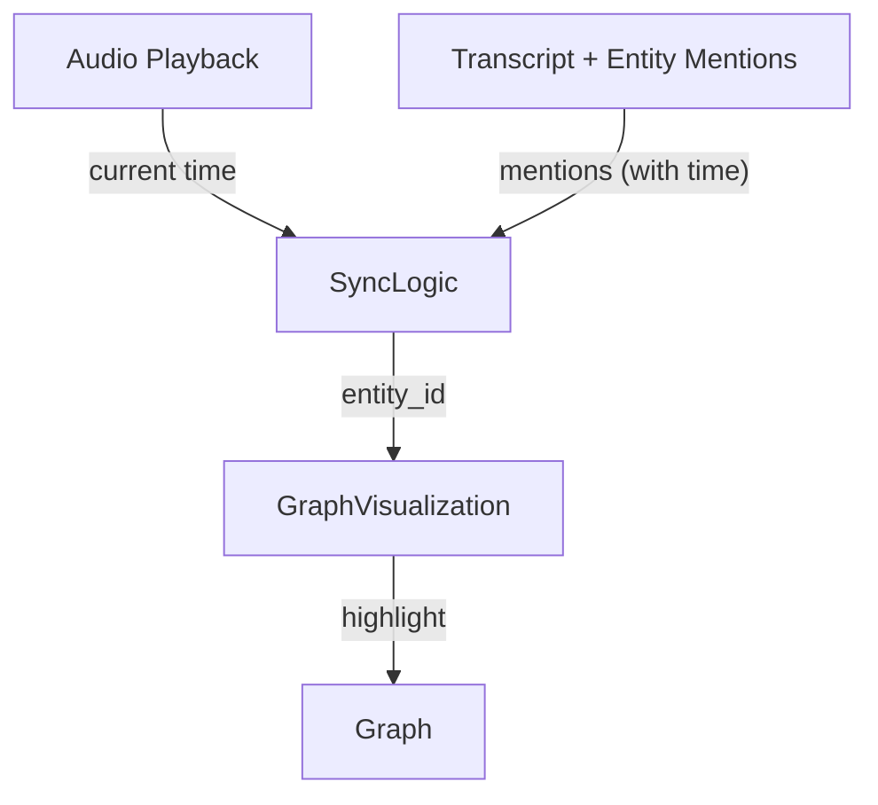
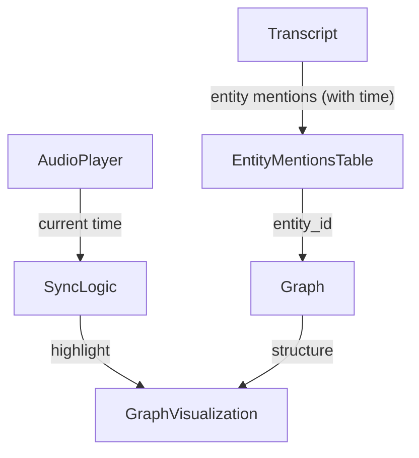

# Audio-Graph Synchronization Feature

## Overview

This feature enables real-time synchronization between audio playback of transcripts and a knowledge graph visualization. As the audio plays, nodes (entities) and relationships in the graph are highlighted in sync with their mentions in the transcript, providing an interactive, immersive experience for users.

---

## Architecture

### Key Components
- **Transcripts**: Documents with word-level timestamps and entity mentions.
- **Knowledge Graph**: Abstract graph of entities and relationships, associated with documents/chunks (not word-level data).
- **Entity Mentions Table**: A bridge table/index that links transcript mentions (with timestamps) to graph entity IDs.
- **Frontend Visualization**: UI that plays audio, displays the transcript, and highlights graph nodes/edges in real time.

---

## Data Model

### Entity Mentions Table
| transcript_id | chunk_number | start_word | end_word | start_time | end_time | entity_id (graph) |
|---------------|-------------|------------|----------|------------|----------|-------------------|
| transcript1   | 0           | 15         | 16       | 12.3       | 13.1     | person_1          |
| transcript1   | 0           | 20         | 20       | 15.0       | 15.2     | location_2        |

- **Purpose**: Acts as a bridge between transcript timing and graph entities.
- **Populated by**: Entity extraction and resolution pipeline during transcript processing.

---

## Data Flow

1. **Audio playback** emits the current timestamp.
2. **Sync logic** queries the entity mentions table for active mentions at that timestamp.
3. **Graph visualization** highlights the corresponding nodes/edges in the graph.

---

## Backend Responsibilities
- **Entity Extraction**: For each transcript, extract entity mentions, resolve to graph entity IDs, and record offsets/timestamps.
- **Store Mapping**: Save the entity mentions mapping in a dedicated table or as part of transcript metadata.
- **API**: Provide endpoints to fetch entity mentions for a transcript, and to fetch the graph structure.

---

## Frontend Responsibilities
- **Audio Player**: Emits current playback time.
- **Sync Logic**: For each time update, queries the entity mentions mapping for active mentions.
- **Graph Visualization**: Highlights nodes/edges corresponding to active entity IDs.
- **Optional**: Clicking a node/edge or transcript word can jump the audio to the relevant time.

---

## Rationale & Benefits
- **Decoupling**: The graph remains clean and scalable, agnostic of transcript timing.
- **Scalability**: Graphs can span multiple documents; transcripts can link to the same graph entities.
- **Flexibility**: Supports highlighting at any granularity (word, phrase, chunk) by adjusting the entity mentions table.
- **User Experience**: Provides an interactive, time-synced exploration of knowledge graphs and source material.

---

## Example Usage Scenario
1. User opens a transcript and starts audio playback.
2. As the audio plays, the UI highlights the current word(s) in the transcript and the corresponding node(s) in the graph.
3. User clicks a node in the graph to jump to the first mention in the audio.
4. User clicks a word in the transcript to highlight the corresponding entity in the graph.

---

## Implementation Notes
- The entity mentions table can be stored in the database, a search index, or loaded into memory for fast access.
- For long transcripts, consider precomputing a mapping from time to active entities for efficient lookup.
- The same approach can be extended to relationships (edges) as well as nodes.

---

## Diagram: Component Overview

---

## Next Steps
- Define the schema for the entity mentions table in your backend.
- Update the entity extraction pipeline to record and store mention data.
- Implement API endpoints for fetching entity mentions and graph data.
- Update the frontend to synchronize graph highlights with audio playback.

---

**This architecture provides a robust, scalable foundation for time-synced knowledge graph visualizations.** 