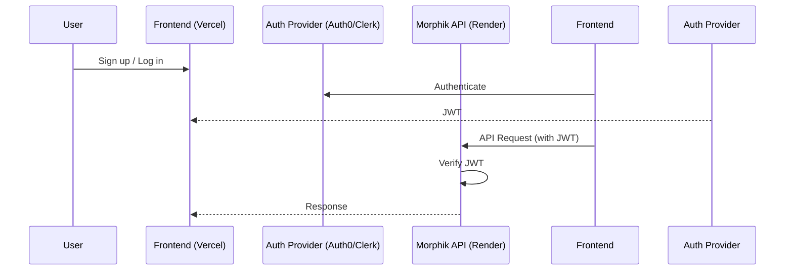

# Authentication Strategy for Morphik Core

## Overview

This document outlines recommendations for implementing an easy, extensible authentication setup for Morphik Core. The goal is to ensure secure, scalable, and maintainable user authentication that integrates smoothly with Morphik's backend and is deployable on Render.

---

## Current Authentication in Morphik Core

- **JWT-Based Auth**: Morphik Core uses JSON Web Tokens (JWT) for authentication.
- **Configurable**: Auth settings are managed via `morphik.toml` and environment variables.
- **Dev Mode**: Allows static users and simple JWTs for local/MVP use.
- **No UI**: No built-in user registration/login UI; expects JWTs to be provided by the frontend or an external provider.

---

## Recommended Authentication Approaches

### 1. **Third-Party Auth Provider (Recommended for Most Cases)**

Use a third-party authentication provider to handle user registration, login, and JWT issuance. The frontend authenticates users and receives a JWT, which it sends to Morphik Core for API requests.

#### **Popular Providers**
- **Auth0**: Easy to set up, supports social login, email/password, and more. Free tier available.
- **Clerk**: Modern, developer-friendly, with React components and good docs.
- **Supabase Auth**: If you want a Postgres-backed auth system (not required here, but an option).

#### **Integration Steps**
1. Set up the auth provider and configure allowed callback URLs (e.g., your Vercel frontend).
2. Configure the provider to issue JWTs.
3. In Morphik Core, configure JWT verification to accept tokens from your provider (update secret/public key as needed).
4. Frontend handles login/signup and stores the JWT (e.g., in localStorage or cookies).
5. Frontend sends the JWT in the `Authorization` header for all API requests.

#### **Pros**
- Handles password resets, social login, MFA, etc.
- Scalable and secure.
- Minimal backend changes to Morphik Core.

#### **Cons**
- Slightly more setup than a pure backend-only solution.
- Some providers have usage-based pricing beyond free tier.

---

### 2. **Backend-Only Auth (Simple, but Less Flexible)**

Implement user registration and login endpoints directly in Morphik Core. On successful login, issue a JWT using Morphik's existing logic.

#### **Integration Steps**
1. Add endpoints for `/register` and `/login` to Morphik Core.
2. Store user credentials in your Postgres database (hashed passwords, etc.).
3. On login, issue a JWT as per current logic.
4. Frontend handles login/signup and stores the JWT.

#### **Pros**
- Fully self-contained.
- No third-party dependencies.

#### **Cons**
- You must handle password resets, email verification, social login, etc.
- More code to maintain and secure.
- Less scalable for future needs.

---

## Render-Specific Features

- **Render does not provide built-in authentication services** for web apps or APIs. You must implement or integrate your own auth solution as described above.
- **Environment Variables**: Render makes it easy to securely store and manage secrets (JWT keys, provider secrets, etc.).
- **Custom Domains & HTTPS**: Render provides HTTPS for custom domains, which is important for secure auth flows.

---

## Recommendation

- **For MVP and production:**
  - Use a third-party auth provider (Auth0 or Clerk are both excellent choices).
  - Configure Morphik Core to verify JWTs from your provider.
  - Use Render's environment variable management for secrets.
- **If you need a fully self-hosted solution:**
  - Extend Morphik Core with registration/login endpoints, but be aware of the extra security and maintenance burden.

---

## Example Flow (with Auth0 or Clerk)

---

## Additional Resources

- [Auth0 Docs](https://auth0.com/docs/quickstart/webapp)
- [Clerk Docs](https://clerk.com/docs)
- [JWT.io](https://jwt.io/)

---

For detailed configuration of JWT verification in Morphik Core, see the main configuration documentation (`morphik.toml`, `.env`). 