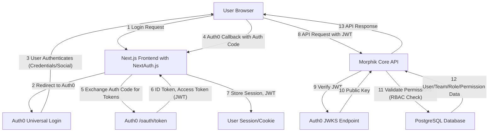
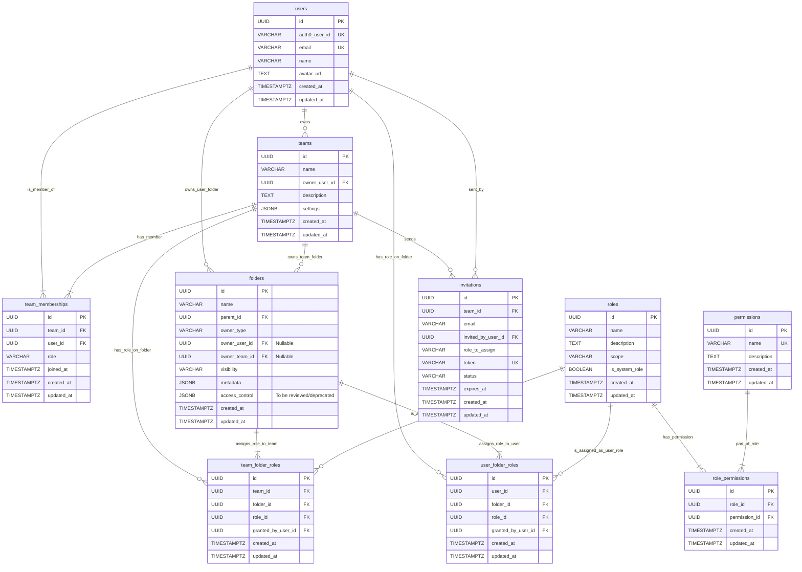

# Moongraph Authentication & Authorization Implementation Plan

## 1. Executive Summary

This document outlines the implementation plan for a robust, scalable, and feature-rich authentication and authorization system for Moongraph. The chosen strategy leverages:

*   **Auth0** as the primary Identity Provider (IdP) for user authentication, handling user registration, login, and social connections.
*   **NextAuth.js** in the Next.js frontend to integrate seamlessly with Auth0, manage client-side sessions, and streamline the OAuth flow.
*   **Morphik Core** for fine-grained authorization logic and data management. This includes a PostgreSQL database schema extension to manage teams, project/folder ownership, roles, granular permissions, and invitations.

This approach separates identity management (who the user is) from authorization (what the user can do), providing flexibility and security.

## 2. Core Requirements Addressed

The proposed solution directly addresses the following key requirements:

*   **Scalable and Robust:** Auth0 is an enterprise-grade IdP designed for scalability. The PostgreSQL backend for authorization is also highly scalable.
*   **Easy to Implement:** Auth0 and NextAuth.js offer well-documented SDKs and clear integration paths, reducing development complexity for authentication. Authorization logic will be custom but built on standard RBAC principles.
*   **Social Logins:** Auth0 provides out-of-the-box support for numerous social identity providers (e.g., Google, GitHub, LinkedIn).
*   **Multi-Tenant Application Support:** The system is designed to support distinct teams/organizations, each with its own users and resources.
*   **Multi-Project Research Team Structures:** Teams can manage multiple projects (represented as folders), controlling access and collaboration within the team.
*   **Enterprise Knowledge Management Structures:** The granular permission model allows for complex organizational hierarchies and access control policies suitable for enterprise use.
*   **Team Management:** Users can create teams, invite others, and manage team membership.
*   **Project/Folder Permissions:** Control over project/folder visibility (public, private, team-only) and user/team permissions (read, write, delete, admin) is central to the design.

## 3. System Architecture Overview

### 3.1. High-Level Diagram



### 3.2. Interaction Flow

1.  **Authentication:**
    *   The user initiates a login action in the frontend.
    *   NextAuth.js redirects the user to Auth0's Universal Login page.
    *   The user authenticates with Auth0 using credentials or a social provider.
    *   Auth0 redirects the user back to the frontend (NextAuth.js callback URL) with an authorization code.
    *   NextAuth.js exchanges the authorization code with Auth0 for an ID token and an access token (JWT).
    *   NextAuth.js establishes a session for the user, storing the tokens securely (e.g., in an HTTPOnly cookie).
2.  **API Requests:**
    *   For requests to the Morphik Core API, the frontend includes the Auth0 JWT in the `Authorization` header (e.g., `Bearer <token>`).
    *   The Morphik Core API receives the request, extracts the JWT.
    *   A middleware in Morphik Core verifies the JWT's signature against Auth0's public keys (JWKS endpoint) and checks its claims (issuer, audience, expiration).
    *   If the JWT is valid, the user's identity (e.g., `sub` claim from JWT, which is the Auth0 user ID) is established.
    *   The API then performs authorization checks based on the user's identity, the requested resource, and the action, by querying the PostgreSQL database for team memberships, roles, and permissions.
    *   If authorized, the API processes the request; otherwise, it returns an appropriate error (e.g., 403 Forbidden).

## 4. Auth0 Configuration (Identity Provider)

**Status: Step 4.1, 4.2 Completed. Step 4.3 In Progress.**

1.  **Create an Auth0 Application:**
    *   In the Auth0 dashboard, create a new Application. **(DONE)**
    *   **Application Type:** Single Page Application (SPA).
    *   Auth0 might ask for the technology your web app is using (e.g., Angular, React, Vue). Since Moongraph's frontend uses Next.js, select **React**.
    *   Note down the **Domain**, **Client ID**, and **Client Secret**. **(DONE)**
2.  **Configure Application URIs:** **(DONE for local development)**
    *   **Allowed Callback URLs:** `http://localhost:3000/api/auth/callback/auth0` (for local development), and equivalent production URLs.
    *   **Allowed Logout URLs:** `http://localhost:3000` (for local development), and equivalent production URLs.
    *   **Allowed Web Origins:** `http://localhost:3000` (for local development), and equivalent production URLs.
    *   **Allowed Origins (CORS):** `http://localhost:3000` (for local development), and equivalent production URLs.
3.  **Enable Social Connections:** **(DONE: Google Configured)**
    *   Navigate to `Authentication > Social` in the Auth0 dashboard.
    *   Enable and configure desired social providers (e.g., Google, GitHub). This usually involves providing Client IDs and Secrets from the respective social platforms.
        *   **Google:** Configured.
4.  **APIs (for Morphik Core access):** **(DONE)**
    *   Create a new API in Auth0 to represent your Morphik Core backend. **(DONE)**
    *   **Name:** e.g., "Morphik Core API" **(DONE, used "Morphik Core API")**
    *   **Identifier (Audience):** A unique URI, e.g., `https://api.moongraph.com`. This will be the `audience` claim in the JWT. **(DONE, used https://api.moongraph.com)**
    *   **Signing Algorithm:** RS256 (recommended). **(DONE, used RS256)**
5.  **User Profile Enrichment (Optional with Auth0 Actions/Rules):** **(To Be Reviewed/Deferred)**
    *   Auth0 Actions (preferred over Rules) can be used to add custom claims to the ID token or Access token during login.
    *   For example, you might create an Action to ensure a `user_metadata` or `app_metadata` field from Auth0 is included in the token, or to perform an initial sync of the user to your `users` table in PostgreSQL if not already present (though typically, user creation in your DB is triggered by the first API call from a new authenticated user).

## 5. Frontend Implementation (Next.js with NextAuth.js)

**Status: Step 5.1 Completed.**

1.  **Install NextAuth.js:** **(DONE)**
    ```bash
    npm install next-auth
    # or
    yarn add next-auth
    # For this project, use pnpm:
    # cd frontend
    # pnpm add next-auth
    ```
2.  **Setup `[...nextauth].js` API Route:** **(DONE)**
    *   Create `src/app/api/auth/[...nextauth]/route.js` (or `.ts` if using TypeScript). **(DONE)**
    ```javascript
    // src/app/api/auth/[...nextauth]/route.js
    import NextAuth from 'next-auth';
    import Auth0Provider from 'next-auth/providers/auth0';

    export const authOptions = {
      providers: [
        Auth0Provider({
          clientId: process.env.AUTH0_CLIENT_ID,
          clientSecret: process.env.AUTH0_CLIENT_SECRET,
          issuer: process.env.AUTH0_ISSUER_BASE_URL, // e.g., https://your-tenant.auth0.com
          authorization: {
            params: {
              audience: process.env.AUTH0_API_IDENTIFIER, // The API Identifier for Morphik Core
            },
          },
        }),
        // Add other providers as needed (e.g., GitHub, Google through NextAuth directly if preferred over Auth0 handling)
      ],
      session: {
        strategy: 'jwt', // Use JWT for session strategy
      },
      callbacks: {
        async jwt({ token, user, account }) {
          // Persist the OAuth access_token and user id to the token right after signin
          if (account && user) {
            token.accessToken = account.access_token;
            token.id = user.id; // This is the Auth0 user ID (sub)
            token.user = user; // Contains profile info from Auth0
          }
          return token;
        },
        async session({ session, token }) {
          // Send properties to the client, like an access_token and user id from the token
          session.accessToken = token.accessToken;
          session.user.id = token.id; // Auth0 user ID
          // Add other user properties from token.user if needed
          session.user.name = token.user?.name;
          session.user.email = token.user?.email;
          session.user.image = token.user?.picture;
          return session;
        },
      },
      // Ensure your Auth0 application is configured for PKCE if not using client secret in a public client
      // Add other NextAuth.js configurations as needed (e.g., database adapter if syncing users, pages for custom login)
    };

    const handler = NextAuth(authOptions);
    export { handler as GET, handler as POST };
    ```
3.  **Environment Variables:** **(In Progress)**
    *   Add to `.env.local` (or your environment configuration):
        ```
        AUTH0_CLIENT_ID=your_auth0_client_id # Example: IMnAxuDkn02IO6Liytg9fzVADV6QRhC2
        AUTH0_CLIENT_SECRET=your_auth0_client_secret # Keep this secret!
        AUTH0_ISSUER_BASE_URL=https://your-tenant.auth0.com # Example: https://dev-bj04f3rw7n8tgam8.us.auth0.com
        AUTH0_API_IDENTIFIER=https://api.moongraph.com # Your Auth0 API Identifier
        NEXTAUTH_URL=http://localhost:3000 # Or your production URL
        NEXTAUTH_SECRET=a_very_secure_random_string # Generate a strong secret
        ```
4.  **Session Provider:** **(DONE)**
    *   Wrap your application layout with `<SessionProvider>`:
    ```javascript
    // src/app/layout.js or a client component wrapper
    'use client';
    import { SessionProvider } from 'next-auth/react';

    export default function RootLayout({ children }) {
      return (
        <html lang="en">
          <body>
            <SessionProvider>{children}</SessionProvider>
          </body>
        </html>
      );
    }
    ```
5.  **Login/Logout UI:** **(Component Created)**
    *   Use `signIn()`, `signOut()`, and `useSession()` from `next-auth/react` to build UI components.
    *   Example Login Button (`frontend/src/components/auth/LoginButton.tsx` created):
        ```javascript
        // components/LoginButton.js
        'use client';
        import { useSession, signIn, signOut } from 'next-auth/react';

        export default function LoginButton() {
          const { data: session } = useSession();
          if (session) {
            return (
              <>
                Signed in as {session.user.email} <br />
                <button onClick={() => signOut()}>Sign out</button>
              </>
            );
          }
          return (
            <>
              Not signed in <br />
              <button onClick={() => signIn('auth0')}>Sign in with Auth0</button>
            </>
          );
        }
        ```
6.  **Sending JWT to Morphik Core API:** **(Guidance Provided - To Be Implemented in API Calls)**
    *   When making API calls, retrieve the access token from the session and include it in the `Authorization` header.
    ```javascript
    // ... existing code ...
    }
    ```
7.  **UI Components for User/Team Management:** **(To Do / Future Development)**
    *   Develop UI components for:
        *   User profile display and management.
        *   Team creation, listing, and joining.
        *   Inviting users to teams.
        *   Managing team members and their roles within the team.
        *   Setting project/folder visibility and permissions.

## 6. Morphik Core Backend - Authentication & Authorization

The Morphik Core backend will be responsible for verifying JWTs received from the frontend and enforcing authorization rules based on the extended database schema.

### 6.1. JWT Verification Middleware

*   Implement middleware in your API framework (e.g., FastAPI, Flask, Express) to:
    *   Extract the JWT from the `Authorization: Bearer <token>` header.
    *   Fetch Auth0's JWKS (JSON Web Key Set) from `https://your-tenant.auth0.com/.well-known/jwks.json`.
    *   Select the appropriate public key from the JWKS based on the `kid` (Key ID) in the JWT header.
    *   Verify the JWT's signature using the public key.
    *   Validate standard claims:
        *   `iss` (Issuer): Must match your `AUTH0_ISSUER_BASE_URL`.
        *   `aud` (Audience): Must match your `AUTH0_API_IDENTIFIER`.
        *   `exp` (Expiration Time): Must be in the future.
    *   If verification is successful, the `sub` claim (Auth0 User ID) can be used to identify the user. This ID should be stored in your `users` table.
    *   Populate an `AuthContext` or similar request-scoped object with the authenticated user's ID and potentially other relevant claims.

    **Example (Conceptual Python/FastAPI):**
    ```python
    # conceptual_auth_middleware.py
    from fastapi import Request, HTTPException, Depends
    from fastapi.security import HTTPBearer, HTTPAuthorizationCredentials
    import jwt
    import requests
    from cachetools import TTLCache # For caching JWKS

    AUTH0_DOMAIN = "your-tenant.auth0.com"
    API_AUDIENCE = "https://api.moongraph.com"
    ALGORITHMS = ["RS256"]
    JWKS_URL = f"https://{AUTH0_DOMAIN}/.well-known/jwks.json"

    # Cache for JWKS keys
    jwks_cache = TTLCache(maxsize=1, ttl=600)

    def get_jwks():
        if "jwks" not in jwks_cache:
            jwks_response = requests.get(JWKS_URL)
            jwks_response.raise_for_status()
            jwks_cache["jwks"] = jwks_response.json()
        return jwks_cache["jwks"]

    def get_signing_key(token):
        try:
            unverified_header = jwt.get_unverified_header(token)
        except jwt.PyJWTError as e:
            raise HTTPException(status_code=401, detail=f"Invalid token header: {e}")
        
        rsa_key = {}
        jwks = get_jwks()
        for key in jwks["keys"]:
            if key["kid"] == unverified_header.get("kid"):
                rsa_key = {
                    "kty": key["kty"],
                    "kid": key["kid"],
                    "use": key["use"],
                    "n": key["n"],
                    "e": key["e"]
                }
        if not rsa_key:
            raise HTTPException(status_code=401, detail="Unable to find appropriate key")
        return rsa_key

    async def get_current_user(credentials: HTTPAuthorizationCredentials = Depends(HTTPBearer())):
        token = credentials.credentials
        try:
            signing_key = get_signing_key(token)
            payload = jwt.decode(
                token,
                signing_key,
                algorithms=ALGORITHMS,
                audience=API_AUDIENCE,
                issuer=f"https://{AUTH0_DOMAIN}/"
            )
            user_id = payload.get("sub") # Auth0 User ID
            if not user_id:
                raise HTTPException(status_code=401, detail="User ID not found in token")
            
            # Here, you would typically fetch/create the user in your database
            # db_user = await get_or_create_user_in_db(user_id, payload) # Example function
            # return db_user
            return {"user_id": user_id, "auth0_payload": payload} # Simplified for example

        except jwt.ExpiredSignatureError:
            raise HTTPException(status_code=401, detail="Token has expired")
        except jwt.InvalidAudienceError:
            raise HTTPException(status_code=401, detail="Incorrect audience")
        except jwt.InvalidIssuerError:
            raise HTTPException(status_code=401, detail="Incorrect issuer")
        except jwt.PyJWTError as e: # Catch other JWT errors
            raise HTTPException(status_code=401, detail=f"Invalid token: {e}")
        except Exception as e:
            # Log the exception e
            raise HTTPException(status_code=500, detail="Error processing token")

    # Usage in an endpoint:
    # @app.get("/secure-data")
    # async def get_secure_data(current_user: dict = Depends(get_current_user)):
    #    return {"message": "This is secure data", "user": current_user}
    ```

### 6.2. Database Schema Extensions (PostgreSQL)

Refer to your existing database schema documents (`000-db_schema.md`, `07-database.md`, `07-database-schema.md`, `09-data-models.md`). The following tables and modifications are proposed. Ensure primary keys are UUIDs where appropriate and foreign keys have proper constraints (ON DELETE CASCADE/SET NULL as appropriate). Add `created_at` and `updated_at` timestamp columns to all new tables.

**New Tables:**

1.  **`users` (if not sufficiently defined, ensure it stores Auth0 User ID)**
    *   `id`: UUID (Primary Key) - Internal Moongraph User ID.
    *   `auth0_user_id`: VARCHAR(255) (Unique, Indexed) - The `sub` claim from Auth0 JWT.
    *   `email`: VARCHAR(255) (Unique, Indexed) - Synced from Auth0.
    *   `name`: VARCHAR(255) (Nullable) - Synced from Auth0.
    *   `avatar_url`: TEXT (Nullable) - Synced from Auth0.
    *   `created_at`: TIMESTAMPTZ DEFAULT NOW()
    *   `updated_at`: TIMESTAMPTZ DEFAULT NOW()
    *   *(Other user-specific profile information)*

2.  **`teams`**
    *   `id`: UUID (Primary Key)
    *   `name`: VARCHAR(255) (Not Null)
    *   `owner_user_id`: UUID (Foreign Key to `users.id`, Not Null) - User who created and owns the team.
    *   `description`: TEXT (Nullable)
    *   `settings`: JSONB (Nullable) - For team-specific settings.
    *   `created_at`: TIMESTAMPTZ DEFAULT NOW()
    *   `updated_at`: TIMESTAMPTZ DEFAULT NOW()

3.  **`team_memberships`** (Junction table for many-to-many between users and teams)
    *   `id`: UUID (Primary Key)
    *   `team_id`: UUID (Foreign Key to `teams.id` ON DELETE CASCADE, Not Null)
    *   `user_id`: UUID (Foreign Key to `users.id` ON DELETE CASCADE, Not Null)
    *   `role`: VARCHAR(50) DEFAULT 'member' (e.g., 'admin', 'member', 'editor') - Role within the team.
    *   `joined_at`: TIMESTAMPTZ DEFAULT NOW()
    *   `created_at`: TIMESTAMPTZ DEFAULT NOW()
    *   `updated_at`: TIMESTAMPTZ DEFAULT NOW()
    *   UNIQUE (`team_id`, `user_id`)

4.  **`permissions`** (Defines available permissions in the system)
    *   `id`: UUID (Primary Key)
    *   `name`: VARCHAR(100) (Unique, Not Null) - e.g., `folder:read`, `folder:write`, `folder:delete`, `folder:manage_members`, `document:edit`.
    *   `description`: TEXT (Nullable)
    *   `created_at`: TIMESTAMPTZ DEFAULT NOW()
    *   `updated_at`: TIMESTAMPTZ DEFAULT NOW()

5.  **`roles`** (Defines roles that group permissions, scoped to resources like folders)
    *   `id`: UUID (Primary Key)
    *   `name`: VARCHAR(100) (Not Null) - e.g., `Folder Viewer`, `Folder Editor`, `Folder Admin`.
    *   `description`: TEXT (Nullable)
    *   `scope`: VARCHAR(50) (Not Null, e.g., 'folder', 'team') - What this role applies to.
    *   `is_system_role`: BOOLEAN DEFAULT FALSE - For predefined system roles.
    *   `created_at`: TIMESTAMPTZ DEFAULT NOW()
    *   `updated_at`: TIMESTAMPTZ DEFAULT NOW()
    *   UNIQUE (`name`, `scope`)

6.  **`role_permissions`** (Junction table for many-to-many between roles and permissions)
    *   `id`: UUID (Primary Key)
    *   `role_id`: UUID (Foreign Key to `roles.id` ON DELETE CASCADE, Not Null)
    *   `permission_id`: UUID (Foreign Key to `permissions.id` ON DELETE CASCADE, Not Null)
    *   `created_at`: TIMESTAMPTZ DEFAULT NOW()
    *   `updated_at`: TIMESTAMPTZ DEFAULT NOW()
    *   UNIQUE (`role_id`, `permission_id`)

7.  **`user_folder_roles`** (Assigns a user a specific role for a given folder)
    *   `id`: UUID (Primary Key)
    *   `user_id`: UUID (Foreign Key to `users.id` ON DELETE CASCADE, Not Null)
    *   `folder_id`: UUID (Foreign Key to `folders.id` ON DELETE CASCADE, Not Null)
    *   `role_id`: UUID (Foreign Key to `roles.id` ON DELETE CASCADE, Not Null)
    *   `granted_by_user_id`: UUID (Foreign Key to `users.id`, Nullable) - Who granted this role.
    *   `created_at`: TIMESTAMPTZ DEFAULT NOW()
    *   `updated_at`: TIMESTAMPTZ DEFAULT NOW()
    *   UNIQUE (`user_id`, `folder_id`, `role_id`)

8.  **`team_folder_roles`** (Assigns a team a specific role for a given folder)
    *   `id`: UUID (Primary Key)
    *   `team_id`: UUID (Foreign Key to `teams.id` ON DELETE CASCADE, Not Null)
    *   `folder_id`: UUID (Foreign Key to `folders.id` ON DELETE CASCADE, Not Null)
    *   `role_id`: UUID (Foreign Key to `roles.id` ON DELETE CASCADE, Not Null)
    *   `granted_by_user_id`: UUID (Foreign Key to `users.id`, Nullable) - Who granted this role.
    *   `created_at`: TIMESTAMPTZ DEFAULT NOW()
    *   `updated_at`: TIMESTAMPTZ DEFAULT NOW()
    *   UNIQUE (`team_id`, `folder_id`, `role_id`)

9.  **`invitations`**
    *   `id`: UUID (Primary Key)
    *   `team_id`: UUID (Foreign Key to `teams.id` ON DELETE CASCADE, Not Null)
    *   `email`: VARCHAR(255) (Not Null, Indexed) - Email of the invitee.
    *   `invited_by_user_id`: UUID (Foreign Key to `users.id` ON DELETE SET NULL, Not Null) - User who sent the invitation.
    *   `role_to_assign`: VARCHAR(50) DEFAULT 'member' (Role in the team upon acceptance).
    *   `token`: VARCHAR(255) (Unique, Not Null, Indexed) - Secure token for the invitation link.
    *   `status`: VARCHAR(20) DEFAULT 'pending' (e.g., 'pending', 'accepted', 'expired', 'revoked').
    *   `expires_at`: TIMESTAMPTZ (Not Null)
    *   `created_at`: TIMESTAMPTZ DEFAULT NOW()
    *   `updated_at`: TIMESTAMPTZ DEFAULT NOW()

**Modifications to Existing Tables (e.g., `folders`):**

Refer to `04-user-folder-scoping.md` and other schema docs.

*   **`folders`** table:
    *   Add `owner_type`: VARCHAR(10) (Not Null, e.g., 'user', 'team'). Add a CHECK constraint `owner_type IN ('user', 'team')`.
    *   Rename/clarify `owner_id` to `owner_user_id`: UUID (Foreign Key to `users.id`, Nullable). This is for user-owned folders.
    *   Add `owner_team_id`: UUID (Foreign Key to `teams.id`, Nullable). This is for team-owned folders.
        *   Add a CHECK constraint: `(owner_type = 'user' AND owner_user_id IS NOT NULL AND owner_team_id IS NULL) OR (owner_type = 'team' AND owner_team_id IS NOT NULL AND owner_user_id IS NULL)`.
    *   Add `visibility`: VARCHAR(20) DEFAULT 'private' (Not Null, e.g., 'private', 'team_shared', 'public_readable').
        *   `private`: Only accessible by the owner (user/team) and users explicitly granted roles.
        *   `team_shared`: If owned by a team, all team members have a default level of access (e.g., read), further refined by roles. If owned by a user but shared with a team, similar logic.
        *   `public_readable`: Anyone (even unauthenticated users, depending on API gateway setup) can read. Write access still requires specific roles.
    *   The existing `access_control` JSONB field:
        *   **Decision Point:** Evaluate if this field is still needed or if its functionality is fully superseded by the new `user_folder_roles` and `team_folder_roles` tables.
        *   If kept, it might be used for very specific, ad-hoc direct permissions that don't fit the role model, or for legacy data. Its interaction with the RBAC system must be clearly defined (e.g., RBAC takes precedence, or they are additive). For simplicity, aim to replace it if possible.

**Entity-Relationship Diagram (Mermaid):**



### 6.3. Authorization Logic (Morphik Core Service Layer)

*   **RBAC Implementation:**
    *   When a user attempts an action on a resource (e.g., read a document in a folder, update folder settings), the API must:
        1.  Identify the user (from `get_current_user`).
        2.  Identify the target resource (e.g., `folder_id`).
        3.  Determine the required permission for the action (e.g., `folder:read`, `folder:write`).
        4.  Check user's direct roles on the folder: Query `user_folder_roles` for the user and folder.
        5.  Check user's team memberships: Query `team_memberships`. For each team the user is part of, check team roles on the folder via `team_folder_roles`.
        6.  Aggregate all applicable roles for the user on that specific folder.
        7.  For each role, fetch its associated permissions from `role_permissions` and `permissions`.
        8.  If the required permission is found among the user's aggregated permissions, allow the action. Otherwise, deny.
*   **Folder Visibility:**
    *   `private`: Only owner (user/team) and directly assigned users/teams (via `user_folder_roles`/`team_folder_roles`) can access.
    *   `team_shared`:
        *   If `owner_type` is 'team', all members of `owner_team_id` get a base level of access (e.g., read, configurable system role for "team members"). Specific roles can override this.
        *   If a folder is shared with other teams (via `team_folder_roles`), their members also get access based on the assigned role.
    *   `public_readable`: Allows read access to anyone (even unauthenticated, if API allows). Write/manage operations still require specific authenticated roles.
*   **Ownership and Admin Privileges:**
    *   The `owner_user_id` of a `team` has implicit administrative rights over the team.
    *   The `owner_user_id` or `owner_team_id` (and its admins) of a `folder` has implicit administrative rights over that folder.
    *   "Admin" roles (e.g., `Team Admin`, `Folder Admin`) grant broad permissions within their scope.
*   **First User/System Setup:**
    *   Upon first successful authentication of a new user via Auth0, a corresponding record should be created in the `users` table in Morphik Core. This can be done lazily on their first API call.
    *   Consider seeding initial `permissions` and `roles` (e.g., 'Folder Admin', 'Folder Editor', 'Folder Viewer', 'Team Admin', 'Team Member') in the database.

### 6.4. New API Endpoints

These are conceptual. Define request/response models (e.g., Pydantic for FastAPI). All endpoints require authentication (JWT verification). Authorization checks are applied within each endpoint.

*   **User Profile:**
    *   `GET /users/me`: Get current authenticated user's profile (from `users` table).
    *   `PUT /users/me`: Update current user's profile.
*   **Teams:**
    *   `POST /teams`: Create a new team. (User becomes owner).
    *   `GET /teams`: List teams the current user is a member of.
    *   `GET /teams/{team_id}`: Get team details (user must be a member or admin).
    *   `PUT /teams/{team_id}`: Update team details (user must be team admin/owner).
    *   `DELETE /teams/{team_id}`: Delete a team (user must be team owner).
*   **Team Memberships:**
    *   `GET /teams/{team_id}/members`: List members of a team.
    *   `PUT /teams/{team_id}/members/{user_id}`: Update a member's role in the team (team admin/owner).
    *   `DELETE /teams/{team_id}/members/{user_id}`: Remove a member from a team (team admin/owner or self).
*   **Invitations:**
    *   `POST /teams/{team_id}/invitations`: Invite a user (by email) to a team (team admin/owner). Generates a token.
    *   `GET /invitations/{token}`: Get invitation details (for invitee to view before accepting).
    *   `POST /invitations/{token}/accept`: Accept an invitation. Adds user to team. User must be authenticated.
    *   `DELETE /invitations/{invitation_id}`: Revoke/cancel an invitation (team admin/owner or inviter).
*   **Folder/Project Permissions (Extending existing folder endpoints or new ones):**
    *   `POST /folders/{folder_id}/share/user`: Grant a user a role on a folder. (Folder admin/owner).
        *   Body: `{ "user_id": "...", "role_id": "..." }`
    *   `POST /folders/{folder_id}/share/team`: Grant a team a role on a folder. (Folder admin/owner).
        *   Body: `{ "team_id": "...", "role_id": "..." }`
    *   `GET /folders/{folder_id}/permissions`: List assigned user and team roles for a folder. (Folder admin/owner or member with sufficient rights).
    *   `PUT /folders/{folder_id}/share/user/{user_id}`: Update a user's role on a folder.
    *   `PUT /folders/{folder_id}/share/team/{team_id}`: Update a team's role on a folder.
    *   `DELETE /folders/{folder_id}/share/user/{user_id}`: Revoke a user's role from a folder.
    *   `DELETE /folders/{folder_id}/share/team/{team_id}`: Revoke a team's role from a folder.
    *   `PUT /folders/{folder_id}/settings`: Update folder settings including `visibility`, `owner_type`, `owner_id`. (Folder admin/owner).
*   **Roles & Permissions (Admin only, for managing the definitions):**
    *   `GET /roles`, `POST /roles`, `GET /roles/{role_id}`, `PUT /roles/{role_id}`, `DELETE /roles/{role_id}`
    *   `GET /permissions`, `POST /permissions` (permissions are likely static definitions, less CRUD)
    *   `POST /roles/{role_id}/permissions/{permission_id}`: Assign permission to role.
    *   `DELETE /roles/{role_id}/permissions/{permission_id}`: Remove permission from role.

## 7. Key User Flows & Scenarios

For each flow, consider creating sequence diagrams.

1.  **New User Signup & Initial Setup:**
    *   User signs up via Auth0 (e.g., with Google).
    *   Redirected to Moongraph. NextAuth.js creates session.
    *   First API call to Morphik Core triggers creation of `users` record.
    *   User is guided to create their first project (folder, user-owned, private by default) or create/join a team.
2.  **Inviting a User to a Team:**
    *   Team Admin navigates to "Team Members" > "Invite".
    *   Enters invitee's email and selects role.
    *   API call `POST /teams/{team_id}/invitations` creates `invitations` record, generates token, sends email (via separate email service).
3.  **User Joins a Team via Invitation:**
    *   Invitee receives email, clicks link `https://moongraph.com/join-team?token=...`.
    *   Frontend calls `GET /invitations/{token}`.
    *   If not authenticated, user is prompted to sign up/login via Auth0.
    *   User confirms. Frontend calls `POST /invitations/{token}/accept`.
    *   API validates token, adds user to `team_memberships`, updates invitation status.
4.  **Creating a Team-Owned Project (Folder):**
    *   Team Admin/Member (with create rights) navigates to team space.
    *   Clicks "New Project".
    *   API call to create folder sets `owner_type='team'`, `owner_team_id` to the current team. `visibility` might default to `team_shared`.
5.  **Setting Project Visibility and Permissions:**
    *   Folder Owner/Admin navigates to Project Settings > Sharing.
    *   Changes `visibility` (e.g., to `public_readable`).
    *   Adds specific users or other teams with specific roles (e.g., "User X gets Editor role", "Team Y gets Viewer role").
    *   API calls to `PUT /folders/{folder_id}/settings` and `POST /folders/{folder_id}/share/...`.
6.  **User Accessing a Document within a Team Project:**
    *   User navigates to a document.
    *   API call to fetch document triggers authorization:
        *   Is folder `public_readable`? If yes, allow read.
        *   Check user's direct role on folder.
        *   Check user's team memberships and those teams' roles on the folder.
        *   Aggregate permissions. If `document:read` (or `folder:read`) is present, allow.
        *   For edits, check for `document:write` (or `folder:write`).
7.  **Enterprise KM Scenario:**
    *   Super Admin (potentially a user with special global roles, outside this immediate scope, or an early user with broad setup privileges) creates multiple top-level teams (e.g., "Engineering", "Marketing", "Research").
    *   Appoints Team Admins for each.
    *   Team Admins create projects (folders) within their teams, set them as `team_shared` or `private` within the team, and invite their respective team members.
    *   Cross-team sharing can be established by Folder Admins granting specific roles to other teams or individuals from other teams on their projects.
8.  **Multi-Project Research Team Scenario:**
    *   A PI (Principal Investigator) creates a "Research Lab" team, becoming its owner.
    *   Invites postdocs, students as members.
    *   Creates multiple projects: "Experiment A" (team_shared), "Grant Proposal" (private to PI and one postdoc initially, later shared with team for feedback), "Shared Datasets" (team_shared, perhaps with a 'viewer' role for most and 'editor' for data managers).

## 8. Future Considerations & Scalability

*   **Database Indexing:** Ensure all foreign keys, unique constraints, and frequently queried columns (especially in `*_folder_roles`, `team_memberships`, `invitations.token`, `users.auth0_user_id`) are indexed.
*   **Permissions Caching:** For high-traffic systems, consider caching resolved user permissions for short periods to reduce DB load (e.g., using Redis). Invalidate cache on role/permission changes.
*   **Audit Logging:** Implement audit trails for sensitive actions: team creation/deletion, membership changes, invitation events, role assignments, folder ownership/visibility changes.
*   **Background Jobs:** For email sending (invitations), use a background worker queue.
*   **Performance Testing:** Simulate concurrent users and complex permission scenarios.

## 9. Deprecating Old Auth Mechanisms

*   Review existing "Dev Mode" static user configurations or any simpler auth systems.
*   Plan a migration path or clearly define scenarios where they might still apply (e.g., local E2E testing isolated from Auth0).
*   For most development and all staging/production environments, the Auth0 + NextAuth.js flow should become standard.
*   Any existing user data will need a strategy for migration or association with new Auth0 user IDs if they are to be preserved.

This plan provides a comprehensive roadmap. Each major section (Auth0 setup, Frontend, Backend DB, Backend Logic, API endpoints) will require significant development effort. 