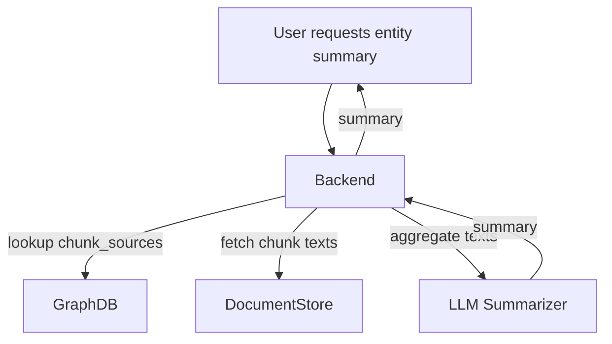

# Entity Summary Generation Feature

## Overview

This feature enables the generation of dynamic, context-rich summaries for entities in the knowledge graph. By aggregating the content of all document chunks associated with a given entity and using an LLM to summarize that content, users can quickly understand the significance and context of any entity in the system.

---

## Rationale
- **Contextual Summaries:** Entity summaries are not static—they reflect the latest, most relevant information from all associated documents and chunks.
- **Scalability:** As new documents are ingested and linked to entities, summaries automatically update when regenerated.
- **User Experience:** Users can explore the knowledge graph and instantly get concise, meaningful overviews of any entity.

---

## Architecture

### Key Components
- **Knowledge Graph:** Stores entities, each with a `chunk_sources` field mapping document IDs to lists of chunk numbers.
- **Document/Chunk Store:** Stores the actual text content of each chunk.
- **LLM Summarizer:** Service or function that takes aggregated text and produces a summary.

---

## Data Flow

1. **User** requests a summary for an entity.
2. **Backend** looks up all (document_id, chunk_number) pairs from the entity's `chunk_sources`.
3. **Backend** retrieves the text for each chunk from the document store.
4. **Backend** aggregates the chunk texts and sends them to the LLM summarizer.
5. **LLM** returns a concise summary, which is sent back to the user.

---

## Backend Implementation Steps
1. **Input:** Entity ID
2. **Lookup:** Retrieve all (document_id, chunk_number) pairs from `entity.chunk_sources`.
3. **Retrieve:** Fetch the text for each chunk.
4. **Aggregate:** Concatenate or otherwise combine the chunk texts.
5. **Summarize:** Use the LLM summarizer to generate the summary.
6. **Return:** Send the summary to the frontend/user.

---

## Frontend Implementation Steps
- **Request:** Provide a UI to request an entity summary (e.g., button or hover action on a node).
- **Display:** Show the returned summary in a modal, sidebar, or tooltip.
- **Optional:** Allow users to refresh the summary to reflect new data.

---

## Example Use Case
1. User clicks on an entity node in the graph visualization.
2. The frontend requests a summary for that entity from the backend.
3. The backend aggregates all relevant chunk texts and generates a summary using the LLM.
4. The summary is displayed to the user, providing a concise overview of the entity's context and significance.

---

## Notes & Enhancements
- **Deduplication:** Optionally deduplicate or cluster similar chunks before summarization.
- **Weighting:** Weight chunks by relevance, recency, or source.
- **Caching:** Cache summaries for frequently accessed entities, invalidating when underlying data changes.
- **Extensibility:** The same approach can be used for relationship summaries or document-level overviews.

---

**This feature provides a scalable, up-to-date, and user-friendly way to understand entities in your knowledge graph.** 