# Collections Model & Collaboration Foundation

## Overview

**Implementation Date:** January 2025  
**Status:** ✅ **FOUNDATION IMPLEMENTED**  
**Database:** PostgreSQL with enhanced RBAC schema  
**Frontend:** Next.js with collections UI  
**Backend:** FastAPI with modular router architecture

This document describes the collections model and collaboration foundation implemented in Moongraph, providing the groundwork for sharing, collaboration, and public discovery features.

## Collections Model Evolution

### From Folders to Collections

**Terminology Evolution:**
- **Database Schema**: Unchanged (`folders` table preserved for stability)
- **Frontend UI**: Updated terminology from "Folders" → "Collections"
- **User Mental Model**: Collections as curated research projects rather than file system folders
- **API Endpoints**: Maintained `/folders/` paths for backwards compatibility

**Why Collections?**
- **Research-Oriented**: Better aligns with academic and research workflows
- **Collaboration-Ready**: Implies shared workspaces and team projects
- **Discovery-Friendly**: Supports public sharing and browsing
- **Growth-Oriented**: Enables viral sharing and community features

### Privacy Levels Implementation

#### Three-Tier Privacy Model

| Privacy Level | Database Value | UI Label | Description | Access Control |
|---------------|----------------|----------|-------------|----------------|
| **Private** | `private` | 🔒 Private | Only you can access | Owner only |
| **Shared** | `shared` | 👥 Shared | Invite collaborators | Owner + invited users |
| **Public** | `public` | 🌐 Public | Discoverable by anyone | Owner + collaborators (edit), Anyone (view) |

#### Database Implementation

```sql
-- Enhanced folders table with privacy levels
CREATE TABLE folders (
    id UUID PRIMARY KEY DEFAULT uuid_generate_v4(),
    name VARCHAR(255) NOT NULL,
    description TEXT,
    
    -- Enhanced ownership model
    owner_type VARCHAR(10) NOT NULL CHECK (owner_type IN ('user', 'team')),
    owner_user_id UUID REFERENCES users(id),
    owner_team_id UUID REFERENCES teams(id),
    
    -- Privacy levels with constraint validation
    visibility VARCHAR(20) NOT NULL DEFAULT 'private' 
        CHECK (visibility IN ('private', 'shared', 'public')),
    
    -- Metadata and audit fields
    system_metadata JSONB DEFAULT '{}',
    access_control JSONB DEFAULT '{}', -- Legacy, superseded by RBAC
    rules JSONB DEFAULT '[]',
    created_at TIMESTAMPTZ DEFAULT NOW(),
    updated_at TIMESTAMPTZ DEFAULT NOW(),
    
    -- Ownership consistency constraints
    CONSTRAINT chk_folder_owner_consistency CHECK (
        (owner_type = 'user' AND owner_user_id IS NOT NULL AND owner_team_id IS NULL) OR
        (owner_type = 'team' AND owner_team_id IS NOT NULL AND owner_user_id IS NULL)
    )
);
```

#### Frontend Implementation

```typescript
// Collection creation modal with privacy selection
const [collectionForm, setCollectionForm] = useState({
  name: "",
  description: "",
  privacy: "private" as "private" | "shared" | "public"
})

// Privacy level UI with clear explanations
<RadioGroup value={collectionForm.privacy} onValueChange={...}>
  <div className="flex items-start space-x-3">
    <RadioGroupItem value="private" />
    <div>
      <Label className="flex items-center gap-2">
        <IconLock className="h-4 w-4" />
        Private
      </Label>
      <p className="text-xs text-muted-foreground">
        Only you can access this collection
      </p>
    </div>
  </div>
  
  <div className="flex items-start space-x-3">
    <RadioGroupItem value="shared" />
    <div>
      <Label className="flex items-center gap-2">
        <IconUsers className="h-4 w-4" />
        Shared
      </Label>
      <p className="text-xs text-muted-foreground">
        Invite collaborators to access this collection
      </p>
    </div>
  </div>
  
  <div className="flex items-start space-x-3">
    <RadioGroupItem value="public" />
    <div>
      <Label className="flex items-center gap-2">
        <IconGlobe className="h-4 w-4" />
        Public
      </Label>
      <p className="text-xs text-muted-foreground">
        Discoverable by anyone, invite collaborators
      </p>
    </div>
  </div>
</RadioGroup>
```

## Permission Inheritance Model

### Folder-Centric Access Control

**Core Principle:** Documents and graphs inherit permissions from their containing collection.

#### Permission Flow

```mermaid
graph TD
    User[User] --> Collection[Collection]
    Collection --> Role[User Role on Collection]
    Role --> Permissions[folder:read, folder:write, folder:admin]
    
    Collection --> Documents[Documents in Collection]
    Collection --> Graphs[Graphs in Collection]
    
    Permissions --> DocAccess[Document Access]
    Permissions --> GraphAccess[Graph Access]
    
    DocAccess --> Read1[folder:read → Document Read]
    DocAccess --> Write1[folder:write → Document Write/Delete]
    
    GraphAccess --> Read2[folder:read → Graph Read]
    GraphAccess --> Write2[folder:write → Graph Write/Update]
    GraphAccess --> Validate[Graph Sharing Validation]
```



#### Implementation Details

**Document Access Logic:**
```python
async def get_document(self, document_id: str, auth: AuthContext) -> Optional[Document]:
    """
    Enhanced document retrieval with folder-based RBAC.
    """
    document = await self._fetch_document_by_id(document_id)
    if not document:
        return None
    
    # Check if document is in a collection
    folder_id = document.system_metadata.get('folder_id')
    if folder_id:
        # Document in collection: check folder permissions
        folder = await self.get_folder(folder_id, auth)  # Requires folder:read
        if not folder:
            return None  # No access to containing collection
        return document
    else:
        # Unfiled document: check direct ownership
        if document.owner.get('id') == auth.user_id:
            return document
        return None  # No access
```

**Graph Access Logic:**
```python
async def get_graph(self, name: str, auth: AuthContext, system_filters: Optional[Dict] = None) -> Optional[Graph]:
    """
    Enhanced graph retrieval with folder-based RBAC and content filtering.
    """
    graph = await self._fetch_graph_by_name(name)
    if not graph:
        return None
    
    # Check if graph is in a collection
    folder_id = graph.system_metadata.get('folder_id')
    if folder_id:
        # Graph in collection: check folder permissions
        folder = await self.get_folder(folder_id, auth)  # Requires folder:read
        if not folder:
            return None  # No access to containing collection
        
        # Filter document_ids based on user's document permissions
        accessible_doc_ids = []
        for doc_id in graph.document_ids:
            doc = await self.get_document(doc_id, auth)
            if doc:
                accessible_doc_ids.append(doc_id)
        
        graph.document_ids = accessible_doc_ids
        return graph
    else:
        # Unfiled graph: check direct ownership and filter documents
        if graph.owner.get('id') == auth.user_id:
            # Filter document_ids based on user's document permissions
            accessible_doc_ids = []
            for doc_id in graph.document_ids:
                doc = await self.get_document(doc_id, auth)
                if doc:
                    accessible_doc_ids.append(doc_id)
            
            graph.document_ids = accessible_doc_ids
            return graph
        return None  # No access
```

### Cross-Resource Validation

**Graph Sharing Validation:**
When a user attempts to make a graph public, the system validates that all contained documents are also accessible publicly:

```python
async def validate_graph_sharing(self, graph_id: str, target_visibility: str, auth: AuthContext) -> Dict[str, Any]:
    """
    Validate that a graph can be shared at the target visibility level.
    """
    graph = await self.get_graph(graph_id, auth)
    if not graph:
        return {"can_share": False, "reason": "Graph not found or access denied"}
    
    if target_visibility == "public":
        blocked_documents = []
        
        for doc_id in graph.document_ids:
            doc = await self.get_document(doc_id, auth)
            if doc:
                # Check if document's collection is public
                folder_id = doc.system_metadata.get('folder_id')
                if folder_id:
                    folder = await self.get_folder(folder_id, auth)
                    if folder and folder.visibility != "public":
                        blocked_documents.append({
                            "document_id": doc_id,
                            "filename": doc.filename,
                            "collection": folder.name,
                            "collection_visibility": folder.visibility
                        })
        
        if blocked_documents:
            return {
                "can_share": False,
                "reason": "Graph contains documents from non-public collections",
                "blocked_documents": blocked_documents
            }
    
    return {"can_share": True}
```

## Collaboration Foundation

### Database Schema for Sharing

**Ready for Implementation:**

```sql
-- Collection invitations table (ready to implement)
CREATE TABLE collection_invitations (
    id UUID PRIMARY KEY DEFAULT uuid_generate_v4(),
    collection_id UUID NOT NULL REFERENCES folders(id) ON DELETE CASCADE,
    inviter_id UUID NOT NULL REFERENCES users(id) ON DELETE CASCADE,
    email VARCHAR(255) NOT NULL,
    token VARCHAR(255) UNIQUE NOT NULL,
    status VARCHAR(20) DEFAULT 'pending' CHECK (status IN ('pending', 'accepted', 'expired', 'cancelled')),
    expires_at TIMESTAMPTZ NOT NULL,
    created_at TIMESTAMPTZ DEFAULT NOW(),
    updated_at TIMESTAMPTZ DEFAULT NOW(),
    
    UNIQUE(collection_id, email)
);

-- Public graph sharing table (ready to implement)
CREATE TABLE public_graphs (
    id UUID PRIMARY KEY DEFAULT uuid_generate_v4(),
    graph_id VARCHAR NOT NULL REFERENCES graphs(id) ON DELETE CASCADE,
    share_token VARCHAR(255) UNIQUE NOT NULL,
    created_by UUID NOT NULL REFERENCES users(id) ON DELETE CASCADE,
    view_count INTEGER DEFAULT 0,
    last_viewed_at TIMESTAMPTZ,
    created_at TIMESTAMPTZ DEFAULT NOW(),
    
    UNIQUE(graph_id)
);

-- Collection sharing analytics (future)
CREATE TABLE collection_shares (
    id UUID PRIMARY KEY DEFAULT uuid_generate_v4(),
    collection_id UUID NOT NULL REFERENCES folders(id) ON DELETE CASCADE,
    shared_by UUID NOT NULL REFERENCES users(id) ON DELETE CASCADE,
    shared_with_email VARCHAR(255),
    share_type VARCHAR(20) NOT NULL CHECK (share_type IN ('invitation', 'public_link')),
    created_at TIMESTAMPTZ DEFAULT NOW()
);
```

### Role-Based Collaboration

**Current Implementation:**
- **FolderAdmin**: Full control over collection (owner by default)
- **FolderEditor**: Read/write access to collection contents
- **FolderViewer**: Read-only access to collection contents

**Assignment Logic:**
```python
async def create_folder(self, folder_data: dict, auth: AuthContext) -> FolderModel:
    """
    Create new collection and assign creator as admin.
    """
    # Create folder
    folder = FolderModel(
        name=folder_data['name'],
        description=folder_data.get('description'),
        owner_type='user',
        owner_user_id=auth.user_id,
        visibility=folder_data.get('visibility', 'private')
    )
    
    # Save folder
    self.session.add(folder)
    self.session.flush()
    
    # Assign creator as FolderAdmin
    admin_role = await self._get_role_by_name('FolderAdmin')
    user_folder_role = UserFolderRoleModel(
        user_id=auth.user_id,
        folder_id=folder.id,
        role_id=admin_role.id,
        granted_by_user_id=auth.user_id
    )
    
    self.session.add(user_folder_role)
    self.session.commit()
    
    return folder
```

### Team Ownership Foundation

**Database Schema (Implemented):**
```sql
-- Teams table
CREATE TABLE teams (
    id UUID PRIMARY KEY DEFAULT uuid_generate_v4(),
    name VARCHAR(255) NOT NULL,
    owner_user_id UUID NOT NULL REFERENCES users(id),
    description TEXT,
    settings JSONB DEFAULT '{}',
    created_at TIMESTAMPTZ DEFAULT NOW(),
    updated_at TIMESTAMPTZ DEFAULT NOW()
);

-- Team memberships
CREATE TABLE team_memberships (
    id UUID PRIMARY KEY DEFAULT uuid_generate_v4(),
    team_id UUID NOT NULL REFERENCES teams(id) ON DELETE CASCADE,
    user_id UUID NOT NULL REFERENCES users(id) ON DELETE CASCADE,
    role VARCHAR(50) DEFAULT 'member' CHECK (role IN ('admin', 'member', 'editor')),
    joined_at TIMESTAMPTZ DEFAULT NOW(),
    created_at TIMESTAMPTZ DEFAULT NOW(),
    updated_at TIMESTAMPTZ DEFAULT NOW(),
    
    UNIQUE(team_id, user_id)
);

-- Team-based collection permissions
CREATE TABLE team_folder_roles (
    id UUID PRIMARY KEY DEFAULT uuid_generate_v4(),
    team_id UUID NOT NULL REFERENCES teams(id) ON DELETE CASCADE,
    folder_id UUID NOT NULL REFERENCES folders(id) ON DELETE CASCADE,
    role_id UUID NOT NULL REFERENCES roles(id) ON DELETE CASCADE,
    granted_by_user_id UUID REFERENCES users(id),
    created_at TIMESTAMPTZ DEFAULT NOW(),
    updated_at TIMESTAMPTZ DEFAULT NOW(),
    
    UNIQUE(team_id, folder_id, role_id)
);
```

**Team-Owned Collections:**
```python
# Collection creation with team ownership
async def create_team_collection(self, team_id: str, folder_data: dict, auth: AuthContext) -> FolderModel:
    """
    Create collection owned by a team.
    """
    # Verify user is team admin
    team_membership = await self._get_team_membership(team_id, auth.user_id)
    if not team_membership or team_membership.role != 'admin':
        raise PermissionError("Only team admins can create team collections")
    
    # Create team-owned folder
    folder = FolderModel(
        name=folder_data['name'],
        description=folder_data.get('description'),
        owner_type='team',
        owner_team_id=team_id,
        visibility=folder_data.get('visibility', 'shared')  # Default to shared for teams
    )
    
    self.session.add(folder)
    self.session.flush()
    
    # Assign team as FolderAdmin
    admin_role = await self._get_role_by_name('FolderAdmin')
    team_folder_role = TeamFolderRoleModel(
        team_id=team_id,
        folder_id=folder.id,
        role_id=admin_role.id,
        granted_by_user_id=auth.user_id
    )
    
    self.session.add(team_folder_role)
    self.session.commit()
    
    return folder
```

## API Router Integration

### Collections Management Endpoints

**Folders Router (`core/api_routers/folders.py`):**

```python
@router.post("/folders")
@telemetry.track(operation_type="create_folder", metadata_resolver=telemetry.create_folder_metadata)
async def create_folder(folder_data: FolderCreate, auth: AuthContext = Depends(verify_token)):
    """
    Create new collection with privacy level.
    Creator automatically gets FolderAdmin role.
    """
    try:
        folder = await document_service.db.create_folder(folder_data.dict(), auth)
        logger.info(f"Created collection '{folder.name}' with visibility '{folder.visibility}' for user {auth.user_id}")
        return folder
    except Exception as e:
        logger.error(f"Error creating collection: {e}", exc_info=True)
        raise HTTPException(status_code=500, detail="Failed to create collection")

@router.get("/folders")
async def list_folders(
    auth: AuthContext = Depends(verify_token),
    skip: int = 0,
    limit: int = 100,
    include_public: bool = False
):
    """
    List accessible collections based on ownership, sharing, and privacy levels.
    """
    try:
        folders = await document_service.db.get_folders(auth, skip, limit, include_public)
        logger.debug(f"Retrieved {len(folders)} collections for user {auth.user_id}")
        return folders
    except Exception as e:
        logger.error(f"Error listing collections: {e}", exc_info=True)
        raise HTTPException(status_code=500, detail="Failed to list collections")

@router.put("/folders/{folder_id}")
@telemetry.track(operation_type="update_folder", metadata_resolver=telemetry.update_folder_metadata)
async def update_folder(
    folder_id: str,
    folder_data: FolderUpdate,
    auth: AuthContext = Depends(verify_token)
):
    """
    Update collection metadata and privacy level.
    Requires folder:admin permission.
    """
    try:
        # Validate folder access
        folder = await document_service.db.get_folder(folder_id, auth)
        if not folder:
            raise HTTPException(status_code=404, detail="Collection not found or access denied")
        
        # Check admin permission for updates
        has_admin = await document_service.db._check_folder_access_rbac(folder, auth, "folder:admin")
        if not has_admin:
            raise HTTPException(status_code=403, detail="Admin permission required to update collection")
        
        # Update folder
        updated_folder = await document_service.db.update_folder(folder_id, folder_data.dict(), auth)
        logger.info(f"Updated collection '{folder.name}' for user {auth.user_id}")
        return updated_folder
    except HTTPException:
        raise
    except Exception as e:
        logger.error(f"Error updating collection: {e}", exc_info=True)
        raise HTTPException(status_code=500, detail="Failed to update collection")
```

### Content Management with Collections

**Document Assignment:**
```python
@router.post("/folders/{folder_id}/documents/{document_id}")
@telemetry.track(operation_type="add_document_to_folder", metadata_resolver=telemetry.folder_document_metadata)
async def add_document_to_folder(
    folder_id: str,
    document_id: str,
    auth: AuthContext = Depends(verify_token)
):
    """
    Add document to collection.
    Requires folder:write permission on target collection.
    """
    try:
        # Validate folder access
        folder = await document_service.db.get_folder(folder_id, auth)
        if not folder:
            raise HTTPException(status_code=404, detail="Collection not found or access denied")
        
        # Check write permission
        has_write = await document_service.db._check_folder_access_rbac(folder, auth, "folder:write")
        if not has_write:
            raise HTTPException(status_code=403, detail="Write permission required to add documents")
        
        # Validate document access
        document = await document_service.db.get_document(document_id, auth)
        if not document:
            raise HTTPException(status_code=404, detail="Document not found or access denied")
        
        # Add document to collection
        await document_service.db.add_document_to_folder(document_id, folder_id, auth)
        logger.info(f"Added document {document_id} to collection {folder_id} by user {auth.user_id}")
        
        return {"success": True, "message": "Document added to collection"}
    except HTTPException:
        raise
    except Exception as e:
        logger.error(f"Error adding document to collection: {e}", exc_info=True)
        raise HTTPException(status_code=500, detail="Failed to add document to collection")
```

## Frontend Collections UI

### Unified Collections Page

**Location:** `frontend/src/app/(authenticated)/unified/page.tsx`

**Key Features:**
- Collections list with privacy level indicators
- Collection creation modal with privacy selection
- Bulk actions toolbar with collection-specific operations
- Document and graph counts per collection
- Privacy level badges and icons

**Collection Creation Flow:**
```typescript
const handleCreateCollection = async () => {
  if (!collectionForm.name.trim()) return

  const effectiveToken = authToken || (process.env.NODE_ENV === "development" ? "devtoken" : null)
  
  if (!effectiveToken) {
    alert("Authentication required")
    return
  }

  setIsCreating(true)
  try {
    const response = await fetch('/api/folders', {
      method: 'POST',
      headers: {
        'Authorization': `Bearer ${effectiveToken}`,
        'Content-Type': 'application/json',
      },
      body: JSON.stringify({
        name: collectionForm.name.trim(),
        description: collectionForm.description.trim() || null,
        visibility: collectionForm.privacy, // 'private', 'shared', 'public'
      }),
    })

    if (!response.ok) {
      throw new Error('Failed to create collection')
    }

    // Reset form and refresh
    setCollectionForm({ name: "", description: "", privacy: "private" })
    setCreateCollectionOpen(false)
    window.location.reload()
  } catch (error) {
    console.error('Error creating collection:', error)
    alert('Failed to create collection. Please try again.')
  } finally {
    setIsCreating(false)
  }
}
```

### Privacy Level UI Components

**Privacy Badges:**
```typescript
const getPrivacyBadge = (visibility: string) => {
  switch (visibility) {
    case 'private':
      return (
        <Badge variant="secondary" className="flex items-center gap-1">
          <IconLock className="h-3 w-3" />
          Private
        </Badge>
      )
    case 'shared':
      return (
        <Badge variant="outline" className="flex items-center gap-1">
          <IconUsers className="h-3 w-3" />
          Shared
        </Badge>
      )
    case 'public':
      return (
        <Badge variant="default" className="flex items-center gap-1">
          <IconGlobe className="h-3 w-3" />
          Public
        </Badge>
      )
    default:
      return null
  }
}
```

**Bulk Actions for Collections:**
```typescript
const collectionActions: BulkAction[] = [
  {
    id: "share",
    label: "Share Collection",
    icon: <IconShare className="h-4 w-4" />,
    onClick: () => console.log("Share collection"),
    disabled: true // Ready for implementation
  },
  {
    id: "export",
    label: "Export Collection",
    icon: <IconFileText className="h-4 w-4" />,
    onClick: () => console.log("Export collection"),
    disabled: true // Ready for implementation
  },
  {
    id: "change-privacy",
    label: "Change Privacy",
    icon: <IconSettings className="h-4 w-4" />,
    onClick: () => console.log("Change privacy"),
    disabled: true // Ready for implementation
  }
]
```

## Future Implementation Roadmap

### Phase 1: Email Invitations (Ready)

**Database Schema:** ✅ Complete
**API Endpoints:** 🔄 Ready to implement
**Frontend UI:** 🔄 Ready to implement

```typescript
// Invitation API endpoints (ready to implement)
POST   /collections/{id}/invitations   // Send invitation
GET    /collections/{id}/invitations   // List pending invitations
DELETE /invitations/{token}            // Cancel invitation
POST   /invitations/{token}/accept     // Accept invitation
GET    /invitations/{token}            // Get invitation details
```

### Phase 2: Public Discovery (Ready)

**Database Schema:** ✅ Complete
**API Endpoints:** 🔄 Ready to implement
**Frontend UI:** 🔄 Ready to implement

```typescript
// Public sharing API endpoints (ready to implement)
POST   /graphs/{id}/public-share       // Create public share link
DELETE /graphs/{id}/public-share       // Remove public sharing
GET    /public/graphs/{token}          // View public graph (no auth)
GET    /public/collections             // Browse public collections
```

### Phase 3: Team Collaboration (Ready)

**Database Schema:** ✅ Complete
**API Endpoints:** 🔄 Ready to implement
**Frontend UI:** 🔄 Ready to implement

```typescript
// Team collaboration API endpoints (ready to implement)
POST   /teams                          // Create team
POST   /teams/{id}/members             // Invite team member
POST   /teams/{id}/collections         // Create team collection
GET    /teams/{id}/collections         // List team collections
```

### Phase 4: Advanced Features (Foundation Ready)

**Analytics & Insights:**
- Collection usage statistics
- Collaboration activity tracking
- Public discovery metrics

**Advanced Permissions:**
- Read-only collaborator roles
- Collection admin delegation
- Granular content permissions

**Discovery Features:**
- Public collection browsing
- Search across public content
- Recommendation engine

## Security Considerations

### Privacy Level Enforcement

**Database Level:**
- CHECK constraints on visibility values
- Ownership consistency constraints
- Foreign key cascade rules

**API Level:**
- Permission validation before any operation
- Cross-resource validation for sharing
- Audit logging for permission changes

**Frontend Level:**
- Privacy level indicators throughout UI
- Clear explanations of sharing implications
- Confirmation dialogs for privacy changes

### Access Control Validation

**Collection Access:**
```python
async def validate_collection_access(self, collection_id: str, auth: AuthContext, required_permission: str) -> bool:
    """
    Comprehensive collection access validation.
    """
    collection = await self.get_folder(collection_id, auth)
    if not collection:
        return False
    
    # Check direct ownership
    if collection.owner_type == 'user' and collection.owner_user_id == auth.user_id:
        return True
    
    # Check team ownership
    if collection.owner_type == 'team':
        team_membership = await self._get_team_membership(collection.owner_team_id, auth.user_id)
        if team_membership and team_membership.role in ['admin', 'editor']:
            return True
    
    # Check RBAC permissions
    return await self._check_folder_access_rbac(collection, auth, required_permission)
```

### Data Protection

**Sensitive Information:**
- User email addresses in invitations
- Collection metadata and descriptions
- Document and graph content

**Protection Measures:**
- Encrypted invitation tokens
- Rate limiting on invitation sending
- Audit trails for all sharing activities
- Secure token generation for public sharing

## Performance Considerations

### Database Optimization

**Indexes for Collections:**
```sql
-- Collection queries
CREATE INDEX idx_folders_owner_user_id ON folders(owner_user_id);
CREATE INDEX idx_folders_owner_team_id ON folders(owner_team_id);
CREATE INDEX idx_folders_visibility ON folders(visibility);
CREATE INDEX idx_folders_created_at ON folders(created_at);

-- Permission resolution
CREATE INDEX idx_user_folder_roles_user_folder ON user_folder_roles(user_id, folder_id);
CREATE INDEX idx_team_folder_roles_team_folder ON team_folder_roles(team_id, folder_id);

-- Content relationships
CREATE INDEX idx_documents_folder_id ON documents(folder_id);
CREATE INDEX idx_graphs_folder_id ON graphs(folder_id);
```

**Query Optimization:**
- Efficient permission resolution with proper JOINs
- Pagination for large collection lists
- Lazy loading of collection contents
- Caching of frequently accessed collections

### API Performance

**Router Efficiency:**
- Modular router architecture reduces memory footprint
- Focused endpoint groupings improve maintainability
- Consistent telemetry tracking across all operations
- Efficient error handling and logging

**Frontend Performance:**
- Optimistic UI updates for collection operations
- Efficient state management for collection data
- Lazy loading of collection contents
- Responsive design for mobile devices

## Testing Strategy

### Database Testing

**Schema Validation:**
```sql
-- Test privacy level constraints
INSERT INTO folders (name, owner_type, owner_user_id, visibility) 
VALUES ('Test', 'user', '...', 'invalid'); -- Should fail

-- Test ownership consistency
INSERT INTO folders (name, owner_type, owner_user_id, owner_team_id) 
VALUES ('Test', 'user', '...', '...'); -- Should fail
```

**Permission Testing:**
```python
async def test_collection_permission_inheritance():
    # Create collection with user as admin
    # Add document to collection
    # Test access with different users/roles
    # Verify permission inheritance
```

### API Testing

**Collection Operations:**
```python
async def test_collection_crud():
    # Test collection creation with different privacy levels
    # Test collection updates and privacy changes
    # Test collection deletion and cascade effects
    # Test permission validation for all operations
```

**Content Management:**
```python
async def test_document_collection_assignment():
    # Test adding documents to collections
    # Test removing documents from collections
    # Test permission validation for assignments
    # Test bulk operations
```

### Frontend Testing

**UI Components:**
- Collection creation modal functionality
- Privacy level selection and validation
- Bulk actions toolbar operations
- Collection list rendering and filtering

**User Flows:**
- Complete collection creation flow
- Document upload and assignment flow
- Privacy level change flow
- Collection sharing preparation flow

## Conclusion

The collections model and collaboration foundation provides a robust, scalable platform for research collaboration in Moongraph. Key achievements include:

### ✅ Implemented Features
- **Collections Model**: Enhanced folder system with privacy levels
- **Permission Inheritance**: Documents and graphs inherit collection permissions
- **Database Foundation**: Complete schema for sharing and collaboration
- **API Integration**: Modular router architecture with consistent RBAC
- **Frontend UI**: Collections creation and management interface

### 🔄 Ready for Implementation
- **Email Invitations**: Database schema and API patterns established
- **Public Discovery**: Public sharing infrastructure prepared
- **Team Collaboration**: Team ownership and membership systems ready
- **Advanced Features**: Foundation for analytics, insights, and discovery

### 🚀 Growth Enablers
- **Viral Sharing**: Email invitation system ready for implementation
- **Public Discovery**: Public collections and graphs for community growth
- **Team Features**: Organization-level collaboration capabilities
- **Scalable Architecture**: Modular design supports future enhancements

This foundation positions Moongraph for successful beta launch with collaboration features while providing a clear path for future growth and community building. 