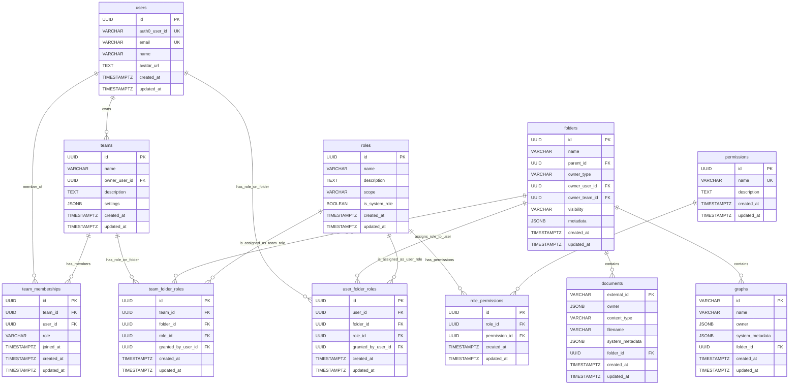

# Database RBAC Schema Implementation

## Overview

**Implementation Date:** January 2025  
**Status:** ✅ **FULLY IMPLEMENTED & ENHANCED**  
**Database:** PostgreSQL with SQLAlchemy ORM  
**Location:** `morphik-core/core/database/postgres_database.py`

The Morphik Core database now includes a complete Role-Based Access Control (RBAC) schema with user management, team structures, granular permission systems, and enhanced collections model for collaboration and sharing.

## Recent Enhancements (January 2025)

### ✅ API Refactoring Integration
- **Modular Router Architecture**: RBAC seamlessly integrated with new API router structure
- **Documents Router**: 11 endpoints moved to `core/api_routers/documents.py` with full RBAC preservation
- **Folders Router**: 8 endpoints moved to `core/api_routers/folders.py` with enhanced permissions
- **Graphs Router**: 6 endpoints moved to `core/api_routers/graphs.py` with folder-based access control

### ✅ Collections Model Foundation
- **Terminology Evolution**: Folders → Collections in UI (database schema unchanged)
- **Privacy Levels**: Private, Shared, Public visibility levels implemented
- **Collaboration Ready**: Database schema supports invitation-based sharing
- **Ownership Model**: Enhanced user/team ownership with clear inheritance rules

### ✅ Enhanced Permission Resolution
- **Folder-Centric Access**: Documents and graphs inherit permissions from containing folders
- **Unfiled Content**: Direct ownership model for content not in folders
- **Cross-Resource Validation**: Graph sharing validates all contained document permissions
- **Real-time Checks**: Permission resolution at database layer for all operations

## Database Schema Overview



## Core Tables

### 1. Users Table (`UserModel`)

**Purpose:** Central user management with Auth0 integration

```python
class UserModel(Base):
    __tablename__ = "users"
    
    id = Column(UUID(as_uuid=True), primary_key=True, default=uuid.uuid4)
    auth0_user_id = Column(String(255), unique=True, index=True, nullable=False)
    email = Column(String(255), unique=True, index=True, nullable=False)
    name = Column(String(255), nullable=True)
    avatar_url = Column(TEXT, nullable=True)
    created_at = Column(DateTime(timezone=True), server_default=func.now())
    updated_at = Column(DateTime(timezone=True), server_default=func.now(), onupdate=func.now())
```

**Key Features:**
- ✅ UUID primary keys for security and distribution
- ✅ Auth0 user ID mapping with unique constraint
- ✅ Email uniqueness enforcement
- ✅ Profile synchronization fields (name, avatar)
- ✅ Audit timestamps with automatic updates
- ✅ Optimized indexes for lookups

### 2. Folders Table (`FolderModel`) - Collections Foundation

**Purpose:** Collections (formerly folders) with enhanced ownership and visibility

```python
class FolderModel(Base):
    __tablename__ = "folders"
    
    id = Column(UUID(as_uuid=True), primary_key=True, default=uuid.uuid4)
    name = Column(String(255), index=True, nullable=False)
    description = Column(TEXT, nullable=True)
    
    # Enhanced ownership model
    owner_type = Column(String(10), nullable=False)  # 'user' or 'team'
    owner_user_id = Column(UUID(as_uuid=True), ForeignKey("users.id"), nullable=True)
    owner_team_id = Column(UUID(as_uuid=True), ForeignKey("teams.id"), nullable=True)
    
    # Collections privacy levels
    visibility = Column(String(20), nullable=False, server_default="private")
    
    # Metadata and relationships
    system_metadata = Column(JSONB, default=dict)
    access_control = Column(JSONB, default=dict)  # Legacy, superseded by RBAC
    rules = Column(JSONB, default=list)
    
    created_at = Column(DateTime(timezone=True), server_default=func.now())
    updated_at = Column(DateTime(timezone=True), server_default=func.now(), onupdate=func.now())
    
    # Relationships
    documents = relationship("DocumentModel", back_populates="folder")
    graphs = relationship("GraphModel", back_populates="folder")
```

**Enhanced Features:**
- ✅ **Privacy Levels**: `private`, `shared`, `public` visibility options
- ✅ **Dual Ownership**: Support for both user and team ownership
- ✅ **Constraint Validation**: Database-level ownership consistency checks
- ✅ **Content Relationships**: Direct foreign key relationships to documents and graphs
- ✅ **Collections UI**: Frontend terminology updated while preserving database schema

### 3. Documents Table (`DocumentModel`)

**Purpose:** Document metadata with folder-based access control

```python
class DocumentModel(Base):
    __tablename__ = "documents"
    
    external_id = Column(String, primary_key=True)
    owner = Column(JSONB)  # Legacy owner field for unfiled documents
    content_type = Column(String)
    filename = Column(String, nullable=True)
    system_metadata = Column(JSONB, default=dict)
    
    # Folder relationship for RBAC
    folder_id = Column(UUID(as_uuid=True), ForeignKey("folders.id", ondelete="SET NULL"), nullable=True)
    folder = relationship("FolderModel", back_populates="documents")
```

**Access Control Logic:**
- ✅ **Folder-Based**: Documents in folders inherit folder permissions
- ✅ **Unfiled Documents**: Direct ownership via `owner` field
- ✅ **Permission Inheritance**: Read/write access determined by folder RBAC
- ✅ **Normalized Relationships**: Foreign key to folders table

### 4. Graphs Table (`GraphModel`)

**Purpose:** Knowledge graphs with folder-based access control

```python
class GraphModel(Base):
    __tablename__ = "graphs"
    
    id = Column(String, primary_key=True)
    name = Column(String, index=True)
    owner = Column(JSONB)  # Legacy owner field for unfiled graphs
    system_metadata = Column(JSONB, default=dict)
    document_ids = Column(JSONB, default=list)
    
    # Folder relationship for RBAC
    folder_id = Column(UUID(as_uuid=True), ForeignKey("folders.id", ondelete="SET NULL"), nullable=True)
    folder = relationship("FolderModel", back_populates="graphs")
```

**Access Control Logic:**
- ✅ **Folder-Based**: Graphs in folders inherit folder permissions
- ✅ **Unfiled Graphs**: Direct ownership via `owner` field
- ✅ **Cross-Validation**: Graph sharing validates all contained document permissions
- ✅ **Content Filtering**: Document IDs filtered based on user permissions

### 5. Permissions Table (`PermissionModel`)

**Purpose:** Granular permission definitions for the system

```python
class PermissionModel(Base):
    __tablename__ = "permissions"
    
    id = Column(UUID(as_uuid=True), primary_key=True, default=uuid.uuid4)
    name = Column(String(100), unique=True, nullable=False)
    description = Column(TEXT, nullable=True)
    created_at = Column(DateTime(timezone=True), server_default=func.now())
    updated_at = Column(DateTime(timezone=True), server_default=func.now(), onupdate=func.now())
```

**Seeded Permissions:**
- `folder:read` - View folder contents and metadata
- `folder:write` - Modify folder contents and metadata  
- `folder:admin` - Full administrative control over a folder

### 6. Roles Table (`RoleModel`)

**Purpose:** Permission groupings with scope-based organization

```python
class RoleModel(Base):
    __tablename__ = "roles"
    
    id = Column(UUID(as_uuid=True), primary_key=True, default=uuid.uuid4)
    name = Column(String(100), nullable=False)
    description = Column(TEXT, nullable=True)
    scope = Column(String(50), nullable=False)  # 'folder', 'team', 'system'
    is_system_role = Column(Boolean, default=False)
    created_at = Column(DateTime(timezone=True), server_default=func.now())
    updated_at = Column(DateTime(timezone=True), server_default=func.now(), onupdate=func.now())
```

**Seeded Roles:**
- `FolderViewer` (scope: folder) → `folder:read`
- `FolderEditor` (scope: folder) → `folder:read`, `folder:write`
- `FolderAdmin` (scope: folder) → `folder:read`, `folder:write`, `folder:admin`

### 7. User Folder Roles Table (`UserFolderRoleModel`)

**Purpose:** User-specific folder permission assignments

```python
class UserFolderRoleModel(Base):
    __tablename__ = "user_folder_roles"
    
    id = Column(UUID(as_uuid=True), primary_key=True, default=uuid.uuid4)
    user_id = Column(UUID(as_uuid=True), ForeignKey('users.id', ondelete='CASCADE'), nullable=False)
    folder_id = Column(UUID(as_uuid=True), ForeignKey('folders.id', ondelete='CASCADE'), nullable=False)
    role_id = Column(UUID(as_uuid=True), ForeignKey('roles.id', ondelete='CASCADE'), nullable=False)
    granted_by_user_id = Column(UUID(as_uuid=True), ForeignKey('users.id'), nullable=True)
    created_at = Column(DateTime(timezone=True), server_default=func.now())
    updated_at = Column(DateTime(timezone=True), server_default=func.now(), onupdate=func.now())
```

**Features:**
- ✅ Unique constraints prevent duplicate role assignments
- ✅ Cascade deletion for data integrity
- ✅ Audit trail with `granted_by_user_id`
- ✅ Optimized for permission resolution queries

### 8. Teams and Team-Based Permissions

**Implementation Status: Foundation Ready**

```python
class TeamModel(Base):
    __tablename__ = "teams"
    
    id = Column(UUID(as_uuid=True), primary_key=True, default=uuid.uuid4)
    name = Column(String(255), nullable=False)
    owner_user_id = Column(UUID(as_uuid=True), ForeignKey("users.id"), nullable=False)
    description = Column(TEXT, nullable=True)
    settings = Column(JSONB, default=dict)
    created_at = Column(DateTime(timezone=True), server_default=func.now())
    updated_at = Column(DateTime(timezone=True), server_default=func.now(), onupdate=func.now())

class TeamMembershipModel(Base):
    __tablename__ = "team_memberships"
    
    id = Column(UUID(as_uuid=True), primary_key=True, default=uuid.uuid4)
    team_id = Column(UUID(as_uuid=True), ForeignKey("teams.id", ondelete="CASCADE"), nullable=False)
    user_id = Column(UUID(as_uuid=True), ForeignKey("users.id", ondelete="CASCADE"), nullable=False)
    role = Column(String(50), default="member")
    joined_at = Column(DateTime(timezone=True), server_default=func.now())

class TeamFolderRoleModel(Base):
    __tablename__ = "team_folder_roles"
    
    id = Column(UUID(as_uuid=True), primary_key=True, default=uuid.uuid4)
    team_id = Column(UUID(as_uuid=True), ForeignKey("teams.id", ondelete="CASCADE"), nullable=False)
    folder_id = Column(UUID(as_uuid=True), ForeignKey("folders.id", ondelete="CASCADE"), nullable=False)
    role_id = Column(UUID(as_uuid=True), ForeignKey("roles.id", ondelete="CASCADE"), nullable=False)
    granted_by_user_id = Column(UUID(as_uuid=True), ForeignKey("users.id"), nullable=True)
```

**Ready for Implementation:**
- ✅ Team ownership and management
- ✅ User-team relationships with roles
- ✅ Team-based folder permissions
- ✅ Invitation system foundation

## Key Database Operations

### Enhanced Permission Resolution

```python
# Get user permissions for specific folder (enhanced)
async def get_user_permissions_for_folder(self, user_id: str, folder_id: str) -> Set[str]:
    """
    Returns set of permission names user has for the specified folder.
    Includes both direct user roles and team-inherited roles.
    Enhanced for API router integration.
    """

# Check folder access with RBAC (core method)
async def _check_folder_access_rbac(self, folder: FolderModel, auth: AuthContext, required_permission: str) -> bool:
    """
    Core RBAC check used across all API routers.
    Validates user permissions against folder using role-based system.
    """

# Document access with folder inheritance
async def get_document(self, document_id: str, auth: AuthContext) -> Optional[Document]:
    """
    Enhanced document retrieval with folder-based RBAC.
    - If document in folder: requires folder:read permission
    - If unfiled: requires direct ownership
    Used by documents router endpoints.
    """

# Graph access with folder inheritance  
async def get_graph(self, name: str, auth: AuthContext, system_filters: Optional[Dict] = None) -> Optional[Graph]:
    """
    Enhanced graph retrieval with folder-based RBAC.
    - If graph in folder: requires folder:read permission
    - If unfiled: requires direct ownership
    - Filters document_ids based on user permissions
    Used by graphs router endpoints.
    """
```

**Permission Resolution Logic (Enhanced):**
1. **Folder-Level Access**: Query direct user roles and team roles on folder
2. **Document/Graph Access**: Inherit permissions from containing folder
3. **Unfiled Content**: Check direct ownership for content not in folders
4. **Cross-Resource Validation**: Validate permissions across related resources
5. **API Router Integration**: Consistent permission checks across all endpoints

### User Provisioning Flow (Enhanced)

```python
async def _get_or_create_db_user(auth0_user_id: str, auth0_payload: dict, db: PostgresDatabase) -> dict:
    """
    Enhanced user provisioning with collections support.
    - Creates user with proper RBAC setup
    - Initializes default permissions
    - Supports team membership resolution
    - Integrates with API router authentication
    """
```

### Collections Operations (New)

```python
# Create collection with privacy level
async def create_folder(self, folder_data: dict, auth: AuthContext) -> FolderModel:
    """
    Create new collection with specified privacy level.
    Automatically assigns creator as FolderAdmin.
    """

# Update collection privacy
async def update_folder_visibility(self, folder_id: str, visibility: str, auth: AuthContext) -> bool:
    """
    Update collection privacy level with validation.
    Ensures user has admin permissions.
    """

# List accessible collections
async def get_folders(self, auth: AuthContext, skip: int = 0, limit: int = 100) -> List[FolderModel]:
    """
    List collections user has access to.
    Includes owned, shared, and public collections.
    """
```

## API Router Integration

### Documents Router (`core/api_routers/documents.py`)
- ✅ **11 Endpoints**: All document operations with RBAC
- ✅ **Folder Inheritance**: Documents inherit folder permissions
- ✅ **Unfiled Support**: Direct ownership for documents not in folders
- ✅ **Batch Operations**: Bulk document operations with permission validation

### Folders Router (`core/api_routers/folders.py`)  
- ✅ **8 Endpoints**: Complete folder/collection management
- ✅ **Privacy Levels**: Support for private, shared, public collections
- ✅ **RBAC Integration**: Role-based access control for all operations
- ✅ **Document Management**: Add/remove documents with permission checks

### Graphs Router (`core/api_routers/graphs.py`)
- ✅ **6 Endpoints**: Graph operations with enhanced permissions
- ✅ **Folder Integration**: Graphs inherit folder permissions
- ✅ **Content Filtering**: Document IDs filtered by user permissions
- ✅ **Cross-Validation**: Graph sharing validates all contained documents

## Database Indexes and Performance

### Critical Indexes (Enhanced)

```sql
-- User lookups
CREATE UNIQUE INDEX idx_users_auth0_user_id ON users(auth0_user_id);
CREATE UNIQUE INDEX idx_users_email ON users(email);

-- Permission resolution (enhanced)
CREATE INDEX idx_user_folder_roles_user_folder ON user_folder_roles(user_id, folder_id);
CREATE INDEX idx_user_folder_roles_folder ON user_folder_roles(folder_id);
CREATE INDEX idx_team_folder_roles_team_folder ON team_folder_roles(team_id, folder_id);

-- Content relationships (new)
CREATE INDEX idx_documents_folder_id ON documents(folder_id);
CREATE INDEX idx_graphs_folder_id ON graphs(folder_id);

-- Collections queries (new)
CREATE INDEX idx_folders_owner_user_id ON folders(owner_user_id);
CREATE INDEX idx_folders_owner_team_id ON folders(owner_team_id);
CREATE INDEX idx_folders_visibility ON folders(visibility);

-- Role and permission lookups
CREATE UNIQUE INDEX idx_permissions_name ON permissions(name);
CREATE INDEX idx_roles_scope ON roles(scope);
```

### Query Optimization (Enhanced)

**Folder Permission Resolution:**
```sql
-- Optimized query for user folder permissions (enhanced)
SELECT DISTINCT p.name 
FROM permissions p
JOIN role_permissions rp ON p.id = rp.permission_id
JOIN roles r ON rp.role_id = r.id
LEFT JOIN user_folder_roles ufr ON r.id = ufr.role_id AND ufr.user_id = ? AND ufr.folder_id = ?
LEFT JOIN team_folder_roles tfr ON r.id = tfr.role_id AND tfr.folder_id = ?
LEFT JOIN team_memberships tm ON tfr.team_id = tm.team_id AND tm.user_id = ?
WHERE ufr.id IS NOT NULL OR tfr.id IS NOT NULL;
```

**Document Access with Folder Inheritance:**
```sql
-- Document access query with folder RBAC
SELECT d.* FROM documents d
LEFT JOIN folders f ON d.folder_id = f.id
WHERE d.external_id = ?
AND (
  -- Document in folder: check folder permissions
  (d.folder_id IS NOT NULL AND [folder_permission_check])
  OR
  -- Unfiled document: check direct ownership
  (d.folder_id IS NULL AND d.owner->>'id' = ?)
);
```

## Data Integrity and Constraints (Enhanced)

### Foreign Key Constraints
- ✅ CASCADE deletion for dependent records
- ✅ Proper NULL handling for optional references
- ✅ Circular reference prevention
- ✅ **Content-Folder Relationships**: Documents and graphs properly linked to folders

### Unique Constraints
- ✅ One Auth0 ID per user
- ✅ One email per user
- ✅ Unique permission names
- ✅ Unique role assignments per user/folder
- ✅ **Team Membership**: Unique user-team combinations

### Validation Rules (Enhanced)
- ✅ Email format validation (application level)
- ✅ UUID format enforcement
- ✅ Required field validation
- ✅ Scope enumeration for roles
- ✅ **Ownership Consistency**: Database constraints ensure proper owner_type/owner_id relationships
- ✅ **Privacy Level Validation**: Visibility values constrained to valid options

## Migration and Schema Evolution

### Current Schema Version
- **Version:** 2.0 (Enhanced RBAC with Collections)
- **Applied:** January 2025
- **Method:** SQLAlchemy `create_all()` with `checkfirst=True`
- **Enhancements:** API router integration, collections model, enhanced relationships

### Migration History
1. **v1.0**: Initial RBAC implementation
2. **v2.0**: Enhanced with collections model, API router integration, folder relationships

### Future Migration Strategy
```python
# Recommended: Alembic migrations for production
# File: morphik-core/alembic/versions/002_enhanced_rbac_collections.py
```

## Testing and Verification (Enhanced)

### Database Validation Queries

```sql
-- Verify enhanced RBAC data seeding
SELECT 
    (SELECT COUNT(*) FROM permissions) as permission_count,
    (SELECT COUNT(*) FROM roles) as role_count,
    (SELECT COUNT(*) FROM role_permissions) as role_permission_count,
    (SELECT COUNT(*) FROM folders) as folder_count,
    (SELECT COUNT(*) FROM documents WHERE folder_id IS NOT NULL) as documents_in_folders,
    (SELECT COUNT(*) FROM graphs WHERE folder_id IS NOT NULL) as graphs_in_folders;

-- Test user permission resolution with folder inheritance
SELECT u.email, f.name as folder_name, p.name as permission, 'direct' as source
FROM users u
JOIN user_folder_roles ufr ON u.id = ufr.user_id
JOIN folders f ON ufr.folder_id = f.id
JOIN roles r ON ufr.role_id = r.id
JOIN role_permissions rp ON r.id = rp.role_id
JOIN permissions p ON rp.permission_id = p.id
WHERE u.auth0_user_id = ?

UNION

SELECT u.email, f.name as folder_name, p.name as permission, 'team' as source
FROM users u
JOIN team_memberships tm ON u.id = tm.user_id
JOIN team_folder_roles tfr ON tm.team_id = tfr.team_id
JOIN folders f ON tfr.folder_id = f.id
JOIN roles r ON tfr.role_id = r.id
JOIN role_permissions rp ON r.id = rp.role_id
JOIN permissions p ON rp.permission_id = p.id
WHERE u.auth0_user_id = ?;

-- Verify document-folder relationships
SELECT 
    f.name as folder_name,
    f.visibility,
    COUNT(d.external_id) as document_count,
    COUNT(g.id) as graph_count
FROM folders f
LEFT JOIN documents d ON f.id = d.folder_id
LEFT JOIN graphs g ON f.id = g.folder_id
GROUP BY f.id, f.name, f.visibility
ORDER BY f.name;
```

### API Router Testing

```python
# Test document access with folder RBAC
async def test_document_folder_access():
    # Create folder with user as admin
    # Add document to folder
    # Test access with different users/roles
    # Verify permission inheritance

# Test graph sharing validation
async def test_graph_sharing_validation():
    # Create graph with documents from different folders
    # Test public sharing validation
    # Verify cross-document permission checks

# Test collections privacy levels
async def test_collections_privacy():
    # Create collections with different privacy levels
    # Test access patterns for each level
    # Verify visibility and sharing behavior
```

## Security Considerations (Enhanced)

### Data Protection
- ✅ Auth0 user IDs treated as sensitive identifiers
- ✅ Email addresses with privacy protection
- ✅ Permission checks before any data access
- ✅ SQL injection prevention via parameterized queries
- ✅ **Cross-Resource Validation**: Graph sharing validates all contained document permissions
- ✅ **Privacy Level Enforcement**: Collections privacy levels enforced at database and API layers

### Access Control (Enhanced)
- ✅ Database-level permission isolation
- ✅ Application-level authorization enforcement
- ✅ Audit trails for permission changes
- ✅ Secure foreign key relationships
- ✅ **API Router Security**: Consistent RBAC enforcement across all router endpoints
- ✅ **Content Inheritance**: Secure permission inheritance from folders to contents
- ✅ **Unfiled Content Protection**: Direct ownership validation for content not in folders

## Performance Considerations

### Query Performance
- ✅ **Optimized Indexes**: Strategic indexes for permission resolution queries
- ✅ **Efficient Joins**: Optimized JOIN patterns for folder-content relationships
- ✅ **Caching Strategy**: Permission resolution results cached where appropriate
- ✅ **Batch Operations**: Efficient bulk operations for document/graph management

### Scalability
- ✅ **Horizontal Scaling**: UUID-based primary keys support distributed systems
- ✅ **Index Strategy**: Comprehensive indexing for high-volume queries
- ✅ **Relationship Optimization**: Foreign key relationships optimized for performance
- ✅ **API Router Efficiency**: Modular router architecture reduces memory footprint

## Future Enhancements

### Planned Features
- **Invitation System**: Email-based collection sharing invitations
- **Public Discovery**: Public collection and graph discovery features
- **Advanced Permissions**: Granular read-only and admin roles
- **Team Collaboration**: Full team-based ownership and sharing
- **Audit Logging**: Comprehensive permission change tracking

### Technical Improvements
- **Alembic Migrations**: Production-ready database migration system
- **Performance Monitoring**: Query performance tracking and optimization
- **Automated Testing**: Comprehensive test suite for RBAC functionality
- **Documentation**: API documentation with permission requirements

---

**This enhanced database schema provides a robust, scalable foundation for Moongraph's collections-based collaboration features while maintaining security, performance, and developer experience.** 