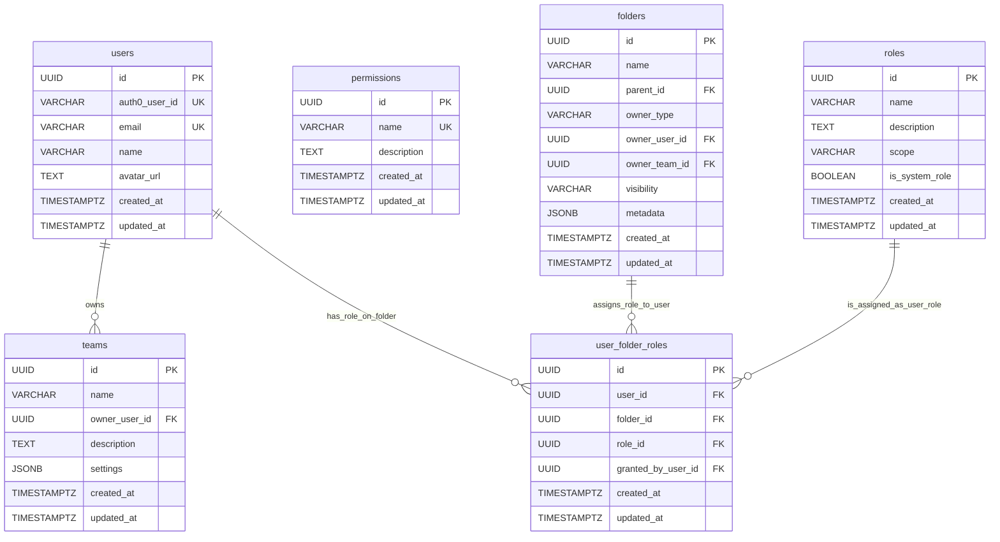

# Database RBAC Schema Implementation

## Overview

**Implementation Date:** January 2025  
**Status:** ✅ **FULLY IMPLEMENTED**  
**Database:** PostgreSQL with SQLAlchemy ORM  
**Location:** `morphik-core/core/database/postgres_database.py`

The Morphik Core database now includes a complete Role-Based Access Control (RBAC) schema with user management, team structures, and granular permission systems.

## Database Schema Overview



## Core Tables

### 1. Users Table (`UserModel`)

**Purpose:** Central user management with Auth0 integration

```python
class UserModel(Base):
    __tablename__ = "users"
    
    id = Column(UUID(as_uuid=True), primary_key=True, default=uuid.uuid4)
    auth0_user_id = Column(String(255), unique=True, index=True, nullable=False)
    email = Column(String(255), unique=True, index=True, nullable=False)
    name = Column(String(255), nullable=True)
    avatar_url = Column(TEXT, nullable=True)
    created_at = Column(DateTime(timezone=True), server_default=func.now())
    updated_at = Column(DateTime(timezone=True), server_default=func.now(), onupdate=func.now())
```

**Key Features:**
- ✅ UUID primary keys for security and distribution
- ✅ Auth0 user ID mapping with unique constraint
- ✅ Email uniqueness enforcement
- ✅ Profile synchronization fields (name, avatar)
- ✅ Audit timestamps with automatic updates
- ✅ Optimized indexes for lookups

### 2. Permissions Table (`PermissionModel`)

**Purpose:** Granular permission definitions for the system

```python
class PermissionModel(Base):
    __tablename__ = "permissions"
    
    id = Column(UUID(as_uuid=True), primary_key=True, default=uuid.uuid4)
    name = Column(String(100), unique=True, nullable=False)
    description = Column(TEXT, nullable=True)
    created_at = Column(DateTime(timezone=True), server_default=func.now())
    updated_at = Column(DateTime(timezone=True), server_default=func.now(), onupdate=func.now())
```

**Seeded Permissions:**
- `folder:read` - View folder contents and metadata
- `folder:write` - Modify folder contents and metadata
- `folder:admin` - Full administrative control over a folder

### 3. Roles Table (`RoleModel`)

**Purpose:** Permission groupings with scope-based organization

```python
class RoleModel(Base):
    __tablename__ = "roles"
    
    id = Column(UUID(as_uuid=True), primary_key=True, default=uuid.uuid4)
    name = Column(String(100), nullable=False)
    description = Column(TEXT, nullable=True)
    scope = Column(String(50), nullable=False)  # 'folder', 'team', 'system'
    is_system_role = Column(Boolean, default=False)
    created_at = Column(DateTime(timezone=True), server_default=func.now())
    updated_at = Column(DateTime(timezone=True), server_default=func.now(), onupdate=func.now())
```

**Seeded Roles:**
- `FolderViewer` (scope: folder) → `folder:read`
- `FolderEditor` (scope: folder) → `folder:read`, `folder:write`
- `FolderAdmin` (scope: folder) → `folder:read`, `folder:write`, `folder:admin`

### 4. User Folder Roles Table (`UserFolderRoleModel`)

**Purpose:** User-specific folder permission assignments

```python
class UserFolderRoleModel(Base):
    __tablename__ = "user_folder_roles"
    
    id = Column(UUID(as_uuid=True), primary_key=True, default=uuid.uuid4)
    user_id = Column(UUID(as_uuid=True), ForeignKey('users.id', ondelete='CASCADE'), nullable=False)
    folder_id = Column(UUID(as_uuid=True), ForeignKey('folders.id', ondelete='CASCADE'), nullable=False)
    role_id = Column(UUID(as_uuid=True), ForeignKey('roles.id', ondelete='CASCADE'), nullable=False)
    granted_by_user_id = Column(UUID(as_uuid=True), ForeignKey('users.id'), nullable=True)
    created_at = Column(DateTime(timezone=True), server_default=func.now())
    updated_at = Column(DateTime(timezone=True), server_default=func.now(), onupdate=func.now())
```

**Features:**
- ✅ Unique constraints prevent duplicate role assignments
- ✅ Cascade deletion for data integrity
- ✅ Audit trail with `granted_by_user_id`
- ✅ Optimized for permission resolution queries

### 5. Teams and Team-Based Permissions

**Future Implementation Ready:**
- `TeamModel` - Team ownership and management
- `TeamMembershipModel` - User-team relationships
- `TeamFolderRoleModel` - Team-based folder permissions
- `InvitationModel` - Team invitation system

## Key Database Operations

### User Operations

```python
# User lookup by Auth0 ID
async def fetch_user_by_auth0_id(self, auth0_user_id: str) -> Optional[Row]:
    """Fetch user by Auth0 user ID"""
    
# User creation from Auth0 data
async def create_user_from_auth0_data(self, user_data: dict) -> UserModel:
    """Create new user from Auth0 profile data"""
```

### Permission Resolution

```python
# Get user permissions for specific folder
async def get_user_permissions_for_folder(self, user_id: str, folder_id: str) -> Set[str]:
    """
    Returns set of permission names user has for the specified folder.
    Includes both direct user roles and team-inherited roles.
    """
```

**Permission Resolution Logic:**
1. Query direct user roles on folder via `user_folder_roles`
2. Query team memberships and team roles on folder via `team_folder_roles`
3. Aggregate all roles for the user on that folder
4. Resolve role permissions via `role_permissions` junction table
5. Return union of all permissions

### RBAC Data Seeding

```python
async def _seed_initial_rbac_data(self):
    """
    Seeds initial permissions and roles into the database.
    Called during database initialization.
    """
```

**Seeded Data:**
- ✅ Core permissions: `folder:read`, `folder:write`, `folder:admin`
- ✅ Standard roles: `FolderViewer`, `FolderEditor`, `FolderAdmin`
- ✅ Role-permission mappings established
- ✅ System role flags set appropriately

## Database Indexes and Performance

### Critical Indexes

```sql
-- User lookups
CREATE UNIQUE INDEX idx_users_auth0_user_id ON users(auth0_user_id);
CREATE UNIQUE INDEX idx_users_email ON users(email);

-- Permission resolution
CREATE INDEX idx_user_folder_roles_user_folder ON user_folder_roles(user_id, folder_id);
CREATE INDEX idx_user_folder_roles_folder ON user_folder_roles(folder_id);

-- Role and permission lookups
CREATE UNIQUE INDEX idx_permissions_name ON permissions(name);
CREATE INDEX idx_roles_scope ON roles(scope);
```

### Query Optimization

**Permission Resolution Query:**
```sql
-- Optimized query for user folder permissions
SELECT DISTINCT p.name 
FROM permissions p
JOIN role_permissions rp ON p.id = rp.permission_id
JOIN roles r ON rp.role_id = r.id
JOIN user_folder_roles ufr ON r.id = ufr.role_id
WHERE ufr.user_id = ? AND ufr.folder_id = ?;
```

## Data Integrity and Constraints

### Foreign Key Constraints
- ✅ CASCADE deletion for dependent records
- ✅ Proper NULL handling for optional references
- ✅ Circular reference prevention

### Unique Constraints
- ✅ One Auth0 ID per user
- ✅ One email per user  
- ✅ Unique permission names
- ✅ Unique role assignments per user/folder

### Validation Rules
- ✅ Email format validation (application level)
- ✅ UUID format enforcement
- ✅ Required field validation
- ✅ Scope enumeration for roles

## Migration and Schema Evolution

### Current Schema Version
- **Version:** 1.0 (Initial RBAC Implementation)
- **Applied:** January 2025
- **Method:** SQLAlchemy `create_all()` with `checkfirst=True`

### Future Migration Strategy
```python
# Recommended: Alembic migrations for production
# File: morphik-core/alembic/versions/001_initial_rbac.py
```

### Hot Reload Development
- ✅ Schema changes applied via Docker hot reload
- ✅ No rebuild required for database updates
- ✅ Development efficiency optimized

## Testing and Verification

### Database Validation Queries

```sql
-- Verify RBAC data seeding
SELECT 
    (SELECT COUNT(*) FROM permissions) as permission_count,
    (SELECT COUNT(*) FROM roles) as role_count,
    (SELECT COUNT(*) FROM role_permissions) as role_permission_count;

-- Test user permission resolution
SELECT u.email, f.name as folder_name, p.name as permission
FROM users u
JOIN user_folder_roles ufr ON u.id = ufr.user_id
JOIN folders f ON ufr.folder_id = f.id
JOIN roles r ON ufr.role_id = r.id
JOIN role_permissions rp ON r.id = rp.role_id
JOIN permissions p ON rp.permission_id = p.id
WHERE u.auth0_user_id = 'google-oauth2|104259399496893983560';
```

### Test Data Setup

```python
# Test user and folder creation for permission testing
test_user_id = "550e8400-e29b-41d4-a716-446655440000"
test_folder_id = "660e8400-e29b-41d4-a716-446655440000"
folder_viewer_role = "FolderViewer"
```

## Backup and Recovery

### Critical Data
- ✅ User profiles and Auth0 mappings
- ✅ Permission and role definitions
- ✅ User-folder role assignments
- ✅ Audit timestamps for compliance

### Backup Strategy
```bash
# PostgreSQL backup
pg_dump morphik_db > rbac_backup_$(date +%Y%m%d).sql

# Restore
psql morphik_db < rbac_backup_20250115.sql
```

## Security Considerations

### Data Protection
- ✅ Auth0 user IDs treated as sensitive identifiers
- ✅ Email addresses with privacy protection
- ✅ Permission checks before any data access
- ✅ SQL injection prevention via parameterized queries

### Access Control
- ✅ Database-level permission isolation
- ✅ Application-level authorization enforcement
- ✅ Audit trails for permission changes
- ✅ Secure foreign key relationships

---

**This database schema provides the foundation for scalable, secure, and maintainable role-based access control in Moongraph.** 