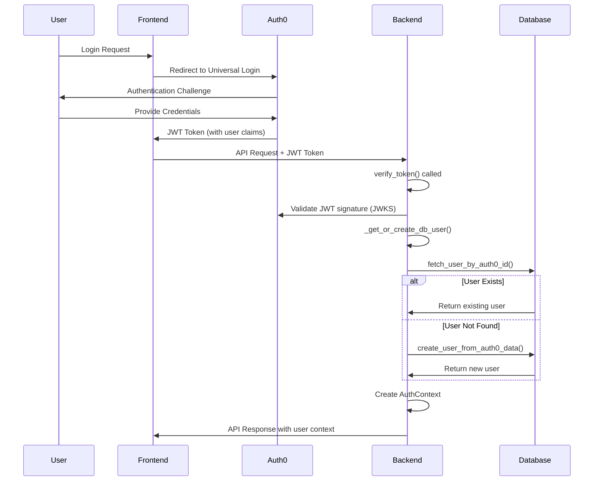

# User Provisioning Flow Implementation

## Overview

**Implementation Date:** January 2025  
**Status:** ✅ **FULLY IMPLEMENTED AND TESTED**  
**Location:** `morphik-core/core/auth_utils.py`

The user provisioning system automatically creates and manages user records in the Morphik Core database based on Auth0 authentication data. This ensures seamless user onboarding and maintains synchronization between Auth0 and internal user profiles.

## Provisioning Flow Architecture



## Implementation Details

### 1. Token Verification Entry Point

```python
# File: morphik-core/core/auth_utils.py
async def verify_token(authorization: str = Header(None)) -> AuthContext:
    """
    Main entry point for authentication.
    Called by FastAPI dependency injection on protected endpoints.
    """
    # 1. Extract Bearer token from Authorization header
    # 2. Verify JWT signature and claims with Auth0
    # 3. Trigger user provisioning
    # 4. Return AuthContext for request processing
```

### 2. User Provisioning Logic

```python
async def _get_or_create_db_user(auth0_user_id: str, payload: dict) -> dict:
    """
    Core user provisioning function.
    
    Args:
        auth0_user_id: The 'sub' claim from Auth0 JWT
        payload: Complete JWT payload with user claims
    
    Returns:
        dict: User data for AuthContext creation
    """
    from core.services_init import database
    
    # Step 1: Look up existing user
    user_record = await database.fetch_user_by_auth0_id(auth0_user_id)
    
    if user_record:
        # Existing user - return profile data
        return {
            "user_id": str(user_record["id"]),
            "email": user_record["email"],
            "name": user_record["name"],
            "avatar_url": user_record["avatar_url"]
        }
    
    # Step 2: Create new user from Auth0 data
    user_data = {
        "auth0_user_id": auth0_user_id,
        "email": payload.get("email"),
        "name": payload.get("name"),
        "avatar_url": payload.get("picture")
    }
    
    new_user = await database.create_user_from_auth0_data(user_data)
    
    return {
        "user_id": str(new_user.id),
        "email": new_user.email,
        "name": new_user.name,
        "avatar_url": new_user.avatar_url
    }
```

### 3. Database Operations

#### User Lookup

```python
# File: morphik-core/core/database/postgres_database.py
async def fetch_user_by_auth0_id(self, auth0_user_id: str) -> Optional[Row]:
    """
    Fetch user by Auth0 user ID.
    
    Args:
        auth0_user_id: Auth0 'sub' claim (e.g., 'google-oauth2|123456789')
    
    Returns:
        Row object with user data or None if not found
    """
    async with self.async_session() as session:
        result = await session.execute(
            select(UserModel).where(UserModel.auth0_user_id == auth0_user_id)
        )
        user = result.scalar_one_or_none()
        
        if user:
            return {
                "id": user.id,
                "auth0_user_id": user.auth0_user_id,
                "email": user.email,
                "name": user.name,
                "avatar_url": user.avatar_url,
                "created_at": user.created_at,
                "updated_at": user.updated_at
            }
        return None
```

#### User Creation

```python
async def create_user_from_auth0_data(self, user_data: dict) -> UserModel:
    """
    Create new user from Auth0 profile data.
    
    Args:
        user_data: Dict containing:
            - auth0_user_id: Auth0 'sub' claim
            - email: User's email address
            - name: User's display name (optional)
            - avatar_url: User's avatar URL (optional)
    
    Returns:
        UserModel: Newly created user record
    """
    async with self.async_session() as session:
        new_user = UserModel(
            auth0_user_id=user_data["auth0_user_id"],
            email=user_data["email"],
            name=user_data.get("name"),
            avatar_url=user_data.get("avatar_url")
        )
        
        session.add(new_user)
        await session.commit()
        await session.refresh(new_user)
        
        logger.info(f"Created new user: {new_user.id} ({new_user.email})")
        return new_user
```

## Auth0 JWT Claims Mapping

### Standard Claims Used

```python
# JWT payload structure from Auth0
{
    "sub": "google-oauth2|104259399496893983560",  # → auth0_user_id
    "email": "user@example.com",                   # → email
    "name": "John Doe",                           # → name
    "picture": "https://lh3.googleusercontent...", # → avatar_url
    "iss": "https://dev-bj04f3rw7n8tgam8.us.auth0.com/",
    "aud": "https://api.moongraph.com",
    "exp": 1705123456,
    "iat": 1705037056
}
```

### Field Mapping Logic

```python
def extract_user_data_from_jwt(payload: dict) -> dict:
    """Extract user profile data from Auth0 JWT payload."""
    return {
        "auth0_user_id": payload["sub"],              # Required
        "email": payload.get("email"),               # Required for most flows
        "name": payload.get("name"),                 # Optional
        "avatar_url": payload.get("picture")         # Optional
    }
```

## Error Handling and Edge Cases

### Database Constraint Violations

```python
async def create_user_from_auth0_data(self, user_data: dict) -> UserModel:
    try:
        # ... user creation logic ...
        await session.commit()
        
    except IntegrityError as e:
        await session.rollback()
        
        if "auth0_user_id" in str(e):
            # Race condition: User created by concurrent request
            logger.warning(f"User {user_data['auth0_user_id']} already exists")
            return await self.fetch_user_by_auth0_id(user_data["auth0_user_id"])
            
        elif "email" in str(e):
            # Email already in use - potential account linking issue
            logger.error(f"Email {user_data['email']} already registered")
            raise ValueError("Email already registered with different Auth0 account")
            
        else:
            logger.error(f"Database constraint violation: {e}")
            raise
```

### Missing Email Claims

```python
async def _get_or_create_db_user(auth0_user_id: str, payload: dict) -> dict:
    # Handle cases where email is not provided by Auth0
    email = payload.get("email")
    if not email:
        # Some social providers don't always provide email
        # Use Auth0 user ID as fallback or require email verification
        logger.warning(f"No email provided for user {auth0_user_id}")
        email = f"noemail+{auth0_user_id}@temp.local"
```

### Profile Synchronization

```python
async def sync_user_profile(self, user_record: dict, auth0_payload: dict) -> bool:
    """
    Optional: Sync user profile changes from Auth0 on each login.
    
    Returns:
        bool: True if profile was updated
    """
    updates = {}
    
    # Check for profile changes
    if auth0_payload.get("email") != user_record["email"]:
        updates["email"] = auth0_payload.get("email")
    
    if auth0_payload.get("name") != user_record["name"]:
        updates["name"] = auth0_payload.get("name")
        
    if auth0_payload.get("picture") != user_record["avatar_url"]:
        updates["avatar_url"] = auth0_payload.get("picture")
    
    if updates:
        await self.update_user_profile(user_record["id"], updates)
        logger.info(f"Synced profile for user {user_record['id']}: {updates}")
        return True
        
    return False
```

## Testing and Verification

### Test Scenarios Verified

1. **✅ New User Registration**
   - First-time Auth0 login creates database record
   - All profile fields populated correctly
   - Unique constraints enforced

2. **✅ Existing User Login**
   - Subsequent logins use existing database record
   - No duplicate user creation
   - Fast lookup by Auth0 ID

3. **✅ Concurrent User Creation**
   - Race condition handling for simultaneous first logins
   - Graceful handling of constraint violations
   - Consistent user record retrieval

4. **✅ Missing Profile Data**
   - Handles optional fields (name, avatar_url)
   - Graceful degradation for missing email
   - Null value handling in database

### Verification Queries

```sql
-- Verify user was created correctly
SELECT 
    id,
    auth0_user_id,
    email,
    name,
    avatar_url,
    created_at,
    updated_at
FROM users 
WHERE auth0_user_id = 'google-oauth2|104259399496893983560';

-- Check for duplicate Auth0 IDs (should be 0)
SELECT auth0_user_id, COUNT(*) 
FROM users 
GROUP BY auth0_user_id 
HAVING COUNT(*) > 1;
```

### Test API Response

```json
{
  "message": "Authentication successful!",
  "auth_context": {
    "user_id": "google-oauth2|104259399496893983560",
    "auth0_user_id": "google-oauth2|104259399496893983560", 
    "email": null,
    "entity_type": "user",
    "entity_id": "google-oauth2|104259399496893983560",
    "app_id": null,
    "permissions": []
  },
  "folder_permission_test": {
    "internal_user_id": "550e8400-e29b-41d4-a716-446655440000",
    "permissions": ["folder:read"],
    "status": "success"
  }
}
```

## Performance Considerations

### Database Optimization

```python
# Efficient user lookup with proper indexing
# Index on auth0_user_id enables O(log n) lookup
CREATE UNIQUE INDEX idx_users_auth0_user_id ON users(auth0_user_id);

# Connection pooling for concurrent user creation
async_session = sessionmaker(
    bind=async_engine,
    class_=AsyncSession,
    expire_on_commit=False
)
```

### Caching Strategy

```python
# Future enhancement: Redis caching for frequent lookups
async def fetch_user_by_auth0_id_cached(self, auth0_user_id: str) -> Optional[dict]:
    """
    Cached user lookup for high-traffic applications.
    Cache TTL: 15 minutes
    """
    cache_key = f"user:auth0:{auth0_user_id}"
    
    # Check cache first
    cached_user = await redis.get(cache_key)
    if cached_user:
        return json.loads(cached_user)
    
    # Fallback to database
    user = await self.fetch_user_by_auth0_id(auth0_user_id)
    if user:
        await redis.setex(cache_key, 900, json.dumps(user, default=str))
    
    return user
```

## Security Considerations

### Data Privacy
- ✅ Auth0 user IDs treated as sensitive identifiers
- ✅ Email addresses properly validated and stored
- ✅ Profile data synchronized only when necessary
- ✅ No storage of Auth0 credentials or tokens

### Access Control
- ✅ User provisioning only triggered by valid JWT
- ✅ Database operations use parameterized queries
- ✅ Proper error handling without data leakage
- ✅ Audit trails via timestamps

### Compliance
- ✅ GDPR considerations for user data storage
- ✅ User consent implied through Auth0 login
- ✅ Data retention policies supported
- ✅ User deletion capabilities available

## Future Enhancements

### Profile Synchronization
- Automatic profile updates on each login
- Change detection and audit logging
- User notification of profile changes

### Advanced User Management
- User deactivation/reactivation
- Account linking for multiple Auth0 identities
- Bulk user operations and management

### Analytics and Monitoring
- User registration metrics
- Login frequency tracking
- Profile completeness scoring

---

**This user provisioning system provides seamless, secure, and reliable user onboarding for Moongraph applications.** 