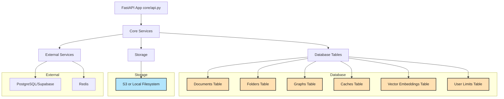

# System Architecture Overview (Simplified)

**Description:**
- This simplified diagram shows the main Morphik API, core services, database tables, storage, and external dependencies.
- Internal flows and detailed service interactions are omitted for clarity.
- Use this as a high-level orientation for new developers or stakeholders. 