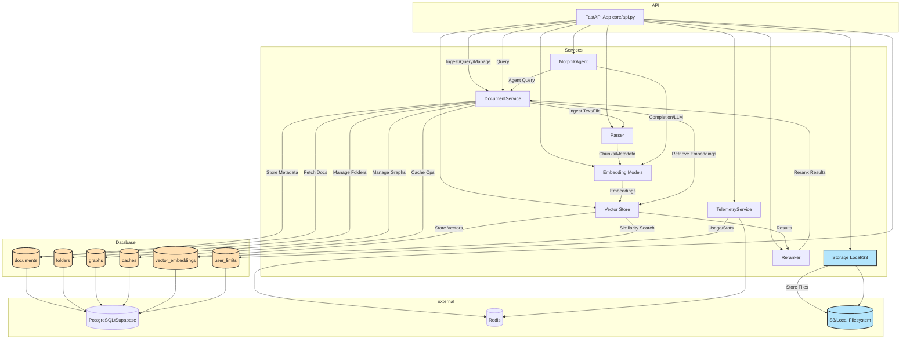

# System Architecture Overview

**Description:**
- This diagram shows the high-level architecture of the Morphik system, including the API, core services, database tables, and external dependencies.
- Database tables are shown in orange, storage in blue, and all text is dark for readability.