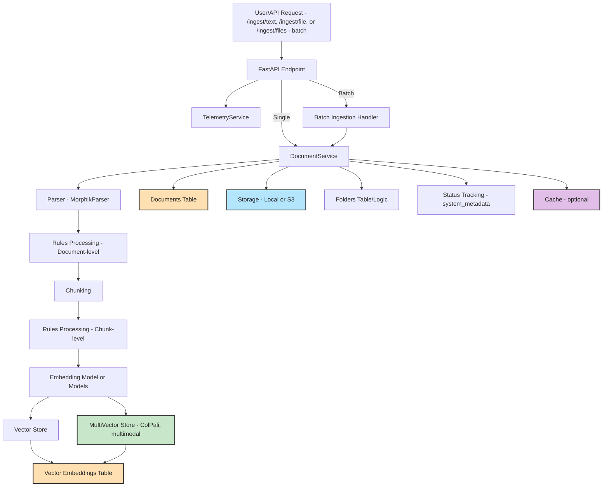

# Document Ingestion Flow

**Description:**
- The user or client sends a document ingestion request (text, file, or batch) to the API.
- The FastAPI endpoint receives the request and passes it to the DocumentService - directly or via a batch handler.
- The DocumentService uses the Parser to extract and chunk the document content.
- **Rules Processing** occurs at two stages:
    - Document-level rules are applied after parsing - e.g., metadata extraction, content transformation.
    - Chunk-level rules are applied after chunking - e.g., per-chunk metadata, content modification.
- Chunks are embedded using the Embedding Model(s):
    - Standard embedding for text chunks.
    - **Multimodal/ColPali** embedding for image or special content - if enabled, with results stored in a separate MultiVector Store.
- Embeddings are stored in the Vector Store(s) and indexed in the vector_embeddings - and optionally multi_vector_embeddings - tables.
- Document metadata, including status tracking - system_metadata, is stored in the documents table.
- The file itself is stored in Local or S3 storage, and storage info is tracked in the document record.
- **Folders**: If a folder_name is provided, the document is associated with a folder - handled in the folders table/logic.
- **Status Tracking**: The document's ingestion status is tracked in system_metadata - e.g., processing, completed, failed.
    - When ingestion starts, status is set to "processing".
    - If an error occurs at any stage, status is set to "failed" and the error message is recorded.
    - When all processing is complete, status is set to "completed".
    - Parsing, chunking, and embedding do **not** update status individually; there is no step-by-step or real-time progress tracking for these stages in the current implementation.
- **Batch Ingestion**: The /ingest/files endpoint allows multiple files to be ingested in parallel, each following the same flow.
- Optionally, cache and telemetry services are updated.

---

## Document Ingestion Telemetry

**Current State:**
- Telemetry is integrated at the FastAPI endpoint level using decorators. This means telemetry is collected for the overall ingestion operation (e.g., total duration, status, and some metadata).
- Internal processing steps such as parsing, chunking, embedding, and storage do **not** emit their own telemetry events or spans. There is no fine-grained telemetry for these stages.
- As a result, telemetry can show when an ingestion request started and finished (or failed), but cannot show how much time was spent in each internal stage or where errors occurred within the pipeline.

**Recommendations for More Granular Telemetry:**
- Add telemetry spans or events within the main processing stages (parsing, rules processing, chunking, embedding, storage, etc.) in the DocumentService and worker code.
    - For example, use OpenTelemetry spans to wrap each major step, so you can see timing and errors for each individually.
    - Record attributes such as document ID, file type, chunk count, embedding model used, etc., at each stage.
- Consider updating status tracking to include more granular states (e.g., "parsing", "chunking", "embedding") if real-time progress is desired.
- Emit error events or logs with telemetry context if failures occur in any internal step.
- This will enable more detailed monitoring, troubleshooting, and performance optimization for the ingestion pipeline.
