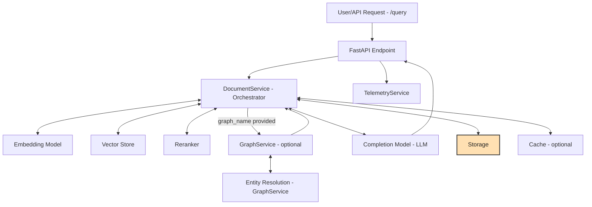

# Query & Completion Flow

**Description:**
- The user or client sends a chat/completion request to the API via the `/query` endpoint.
- The FastAPI endpoint handles authentication, telemetry, and request validation, then delegates to the `DocumentService - Orchestrator`.
- `DocumentService - Orchestrator` coordinates the following sub-services (all with bidirectional communication):
  - **Embedding Model**: Embeds the query for similarity search and returns the embedding to DocumentService.
  - **Vector Store**: Retrieves relevant document chunks based on the query embedding and returns them to DocumentService.
  - **Reranker**: Optionally reranks the retrieved chunks for relevance and returns the reranked list to DocumentService.
  - **GraphService - optional**: If `graph_name` is provided, enhances retrieval by extracting entities from the query, resolving entity variants (via **Entity Resolution - GraphService**), traversing relationships, and retrieving additional relevant chunks. These are returned to DocumentService and combined with vector search results.
  - **Completion Model - LLM**: Receives the selected context chunks from DocumentService and generates the final answer.
  - **Storage**: Used to fetch document and chunk content (side component).
  - **Cache**: Optionally used for fast retrieval/generation, but **not part of the main /query flow** (side component, used via separate endpoints).
  - **TelemetryService**: Tracks usage and performance.
- The response is returned to the user, including the generated answer and relevant metadata.

---

## Relevant API Endpoint for Chat/Completion

### `POST /query`
The main endpoint for chat/completion. Accepts a `CompletionQueryRequest` with the following parameters:

| Parameter         | Type      | Description |
|-------------------|-----------|-------------|
| `query`           | string    | The user query or prompt. |
| `filters`         | object    | (Optional) Metadata filters to restrict the search space. |
| `k`               | integer   | (Optional) Number of chunks to use as context (default: 4). |
| `min_score`       | float     | (Optional) Minimum similarity threshold for chunk retrieval (default: 0.0). |
| `max_tokens`      | integer   | (Optional) Maximum tokens in the completion. |
| `temperature`     | float     | (Optional) Model temperature for completion. |
| `use_reranking`   | bool      | (Optional) Whether to use reranking for chunk selection. |
| `use_colpali`     | bool      | (Optional) Whether to use Colpali-style embedding model for retrieval. |
| `graph_name`      | string    | (Optional) Name of the knowledge graph to use for enhanced retrieval. |
| `hop_depth`       | integer   | (Optional) Number of relationship hops to traverse in the graph (1-3). |
| `include_paths`   | bool      | (Optional) Whether to include relationship paths in the response metadata. |
| `prompt_overrides`| object    | (Optional) Customizations for entity extraction, resolution, and query prompts. |
| `folder_name`     | string    | (Optional) Folder to scope the operation to. |
| `end_user_id`     | string    | (Optional) End-user ID to scope the operation to. |
| `schema`          | object    | (Optional) Schema for structured output (Pydantic model or JSON schema). |

**Returns:**
- `CompletionResponse`: The generated answer, usage statistics, sources, and optional metadata (including graph info if used).

---

## GraphService and Entity Resolution
- If `graph_name` is provided, the system uses `GraphService` to:
  - Extract entities from the query using the LLM.
  - Resolve entity variants (e.g., "JFK" vs "John F. Kennedy") using the EntityResolver.
  - Traverse the knowledge graph to find related entities and documents (up to `hop_depth` relationships).
  - Retrieve additional relevant chunks based on graph structure.
  - Return these chunks to DocumentService, which combines them with vector-based results for context.
  - Optionally include relationship paths in the response metadata if `include_paths` is set.

---

**Legend:**
- **DocumentService - Orchestrator**: Central coordinator for query completion.
- **Embedding Model**: Converts queries to vector representations.
- **Vector Store**: Finds relevant chunks using vector similarity.
- **Reranker**: Improves relevance of retrieved chunks.
- **GraphService**: Enhances retrieval using knowledge graphs and entity resolution.
- **Completion Model - LLM**: Generates the final answer using selected context.
- **Storage**: Manages document and chunk storage (side component).
- **Cache**: Optional, for fast retrieval/generation via separate endpoints (side component).
- **TelemetryService**: Tracks usage and performance.

**Note:**
- The `/retrieve/chunks` and `/retrieve/docs` endpoints are for retrieval only (no LLM/completion) and are documented elsewhere.
- Rules are not used at query time and are not relevant to this flow.
