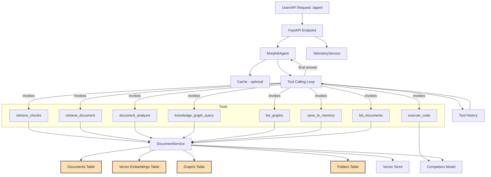

# Agent Flow

**Description:**
- The user or client sends an agent query request to the API.
- The FastAPI endpoint passes the request to the `MorphikAgent`.
- The `MorphikAgent` enters an **iterative tool-calling loop**:
    - The agent sends the user query and system prompt to the LLM.
    - If the LLM requests a tool call, the agent dispatches the call to the appropriate tool implementation.
    - The result of each tool call is appended to the **Tool History**.
    - The agent updates the conversation context with tool results and continues the loop, allowing for multiple tool invocations per query.
    - When the LLM returns a final answer (no further tool calls), the agent returns the answer and the complete tool history.
- The following core tools are available (all currently wired in):
    - `retrieve_chunks`: Retrieve relevant text/image chunks from the knowledge base.
    - `retrieve_document`: Get full document content or metadata.
    - `document_analyzer`: Analyze documents for entities, facts, summary, sentiment, or full analysis.
    - `execute_code`: Run Python code in a safe sandbox (for data analysis, visualization, computation).
    - `knowledge_graph_query`: Query the knowledge graph for entities, paths, subgraphs, or list entities.
    - `list_graphs`: List available knowledge graphs.
    - `save_to_memory`: Save important information to persistent memory (session, long_term, research_thread).
    - `list_documents`: List documents accessible to the agent.
- Most tools interact with the `DocumentService`, which accesses the relevant data sources (documents, vectors, graphs, folders, etc.).
- `execute_code` interacts with the Completion Model (LLM) for code execution and output.
- Telemetry and cache services are updated as needed (primarily at the API/service layer).
- **Tool History** records all tool calls and results for the session, supporting traceability and debugging.
- **Not currently wired into the agent (but present in descriptions.json for future/experimental use):**
    - `query_database`, `table_analyzer`, `multi_document_synthesizer`, `research_planner`, `image_analyzer`, `generate_visualization`, `search_refinement`, `version_compare`.
- These advanced tools are defined for future expansion but are not yet available for agent invocation in the current codebase.
- Authentication and authorization are enforced at the API layer before agent invocation.

### Tool Use Telemetry

**Current State:**
- Telemetry is currently collected at the API layer (e.g., the `/agent` endpoint), capturing high-level metrics such as request/response timing, user, and status.
- There is **no direct, real-time telemetry instrumentation inside the agent's tool-calling loop or for individual tool calls**. The agent tracks tool calls and results in an internal `tool_history`, but this is not sent to telemetry or monitoring systems.
- The architecture diagram accurately reflects this, showing no direct connection between the agent's internal operations and the TelemetryService.

**Recommendations:**
- For deeper operational insight, consider instrumenting the agent to emit telemetry events for:
    - Each tool call (tool name, arguments, timing, success/failure, etc.)
    - Each iteration of the tool-calling loop
    - Final answer generation
    - Errors or exceptions during tool execution
- This can be achieved by calling the `TelemetryService` (or another telemetry/metrics system) from within the agent's code (e.g., in `MorphikAgent.run` and `_execute_tool`).
- Real-time telemetry for agent operations would enable:
    - Monitoring tool usage patterns and performance
    - Tracking tool call durations and error rates
    - Building dashboards for agent activity
    - Auditing and debugging agent behavior in production
