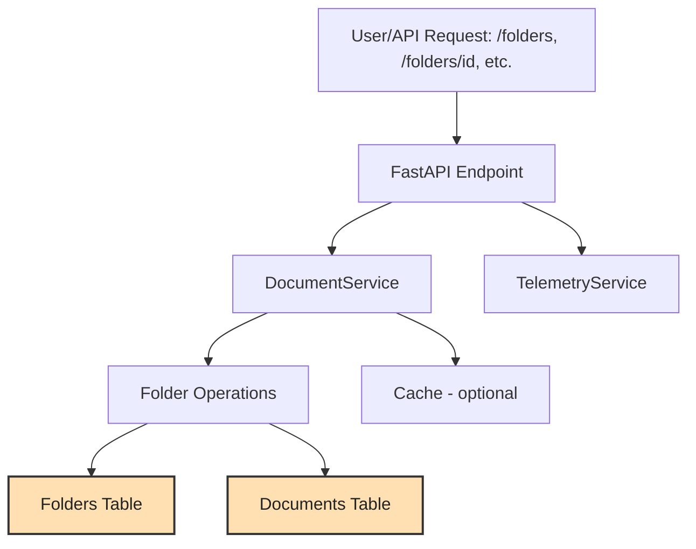

# Folder Management Flow

**Description:**
- The user or client sends a folder management request (create, list, update, delete, add/remove document) to the API.
- The FastAPI endpoint passes the request to the `DocumentService`.
- The `DocumentService` performs the appropriate folder operation (create, update, add/remove document, etc.).
- Folder operations update the `folders` table and may also update the `documents` table (e.g., when adding/removing documents from folders).
- Optionally, cache and telemetry services are updated.
