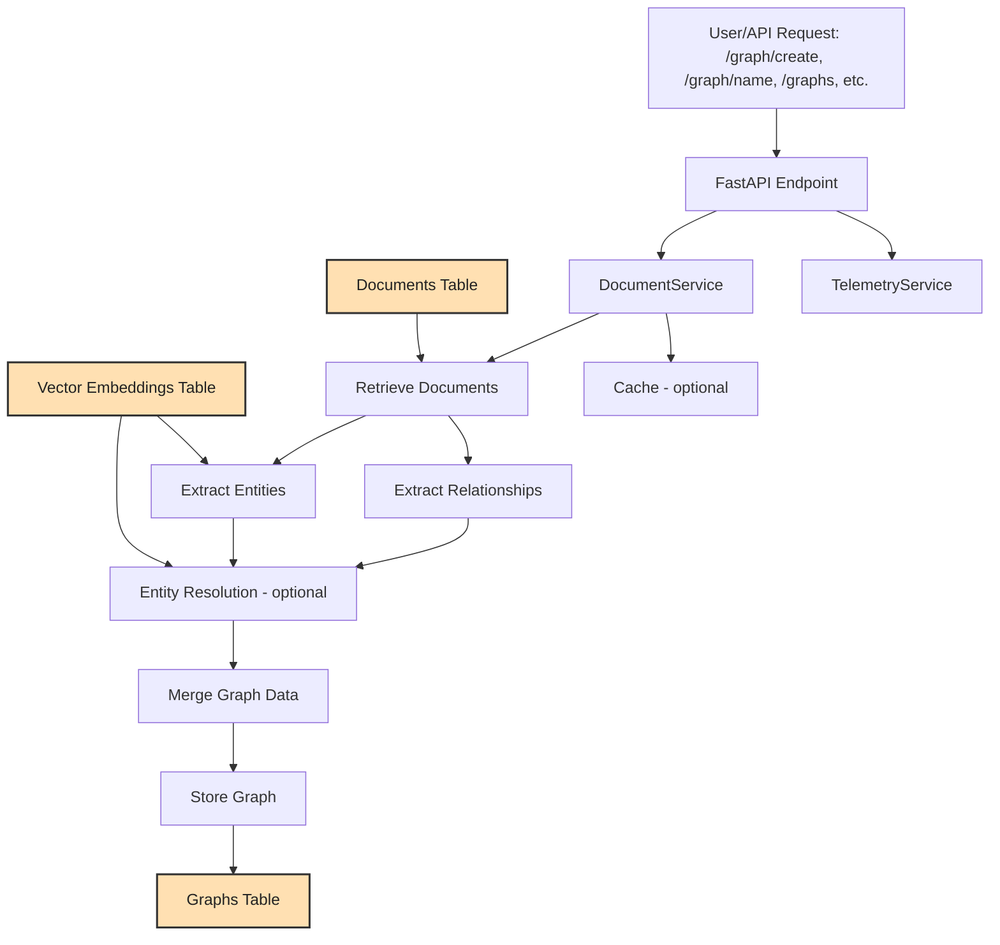

# Graph Operations Flow

**Detailed Description:**
- **User/API Request**: The process begins when a user or client sends a graph operation request (such as create, update, get, or list) to the API endpoints (e.g., `/graph/create`, `/graph/{name}`, `/graphs`).
- **FastAPI Endpoint**: The request is handled by a FastAPI endpoint, which performs authentication, telemetry tracking, and request validation. It then delegates the operation to the `DocumentService`.
- **DocumentService**: This service orchestrates the graph operation. It is responsible for:
  - Passing the request to the `GraphService` for core graph logic.
  - Handling batch retrieval of documents and document chunks as needed.
  - Managing dependencies such as the embedding model, completion model (LLM), and cache.
- **Retrieve Documents**: The `DocumentService` retrieves relevant documents from the `documents` table, either by explicit IDs or by applying filters (including system filters like folder or user scoping).
- **Extract Entities & Relationships**: For each document, the service:
  - Splits the document into chunks.
  - Uses an LLM (via the completion model) to extract entities and relationships from each chunk.
  - Stores extracted entities and relationships, avoiding duplicates by label.
- **Vector Embeddings Table**: Embeddings are used for similarity calculations during entity extraction and (optionally) entity resolution. These are stored in the `vector_embeddings` table and are also used for advanced retrieval and similarity search.
- **Entity Resolution (Optional)**: If enabled, an LLM-based entity resolver deduplicates and canonicalizes entities (e.g., mapping "JFK" and "John F. Kennedy" to a single canonical entity). This step is optional and can be toggled via settings.
- **Merge Graph Data**: The service merges new entities and relationships with any existing graph data, ensuring that document IDs, chunk sources, and properties are updated appropriately. Smart merging logic is used to avoid duplication and to update relationships to use canonical entity IDs if entity resolution was performed.
- **Store Graph**: The updated or newly created graph, including all entities, relationships, metadata, and access control, is stored in the `graphs` table in the database.
- **Graphs Table**: This table holds the persistent representation of each knowledge graph, including its entities, relationships, document associations, filters, and metadata.
- **TelemetryService (Parallel/Optional)**: Telemetry is tracked in parallel for all operations, recording usage, performance, and metadata for monitoring and analytics. This is handled automatically via decorators on the API endpoints.
- **Cache (Parallel/Optional)**: Caching (e.g., LlamaCache, HuggingFaceCache) can be used to accelerate certain operations, but is not a core part of the graph creation/update flow. The cache is managed by the `DocumentService` and can be used for fast retrieval or generation.

**Notes:**
- The flow supports both creation and update of graphs, with update operations merging new data into existing graphs.
- All access control and authorization checks are enforced at both the API and database layers.
- The system is designed to be extensible, supporting additional features such as multi-vector embeddings, advanced filters, and custom prompt overrides for LLMs.
- The diagram and description reflect the actual code logic and data flow in the Morphik core codebase as of this review.

---

### Graph Operations Telemetry

**Current State:**
- Telemetry is currently collected at the API endpoint level for all graph operations (e.g., `/graph/create`, `/graph/{name}/update`, `/graphs`). This includes high-level metrics such as request/response timing, user, operation type, and status.
- There is **no direct, real-time telemetry instrumentation for the internal steps** of graph operations, such as document retrieval, entity extraction, entity resolution, merging graph data, or database writes. These steps are tracked via logging for debugging, but not via telemetry/metrics systems.
- The architecture diagram reflects this by showing telemetry connected to the FastAPI endpoint, but not to the internal service or database steps.

**Recommendations:**
- For deeper operational insight and observability, consider instrumenting the graph operation pipeline to emit telemetry events for:
    - Document retrieval (timing, document count, success/failure)
    - Entity extraction and relationship extraction (timing, entity/relationship counts, errors)
    - Entity resolution (timing, number of entities resolved, errors)
    - Merging and storing graph data (timing, data volume, success/failure)
    - Errors or exceptions at any step
- This can be achieved by calling the `TelemetryService` (or another telemetry/metrics system) from within the relevant service methods (e.g., in `GraphService` and `DocumentService`).
- Fine-grained telemetry for graph operations would enable:
    - Monitoring performance and bottlenecks at each step
    - Tracking data volumes and error rates
    - Building dashboards for graph operation health and throughput
    - Auditing and debugging graph processing in production
