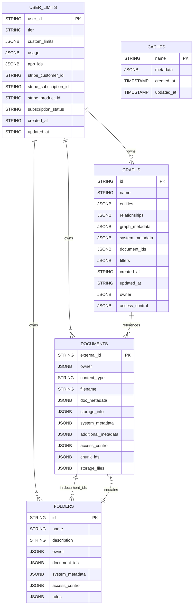
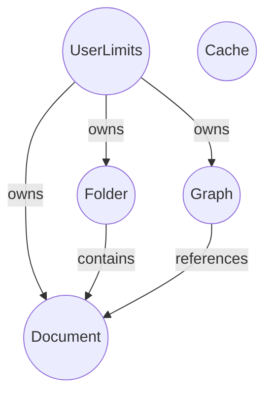
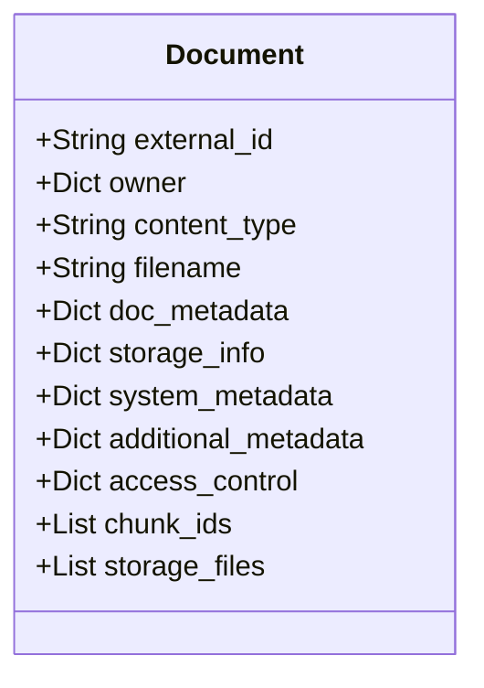

# Morphik Core Database Schema & Operations

## Overview

The Morphik Core backend uses PostgreSQL as its primary database, accessed via SQLAlchemy ORM. The main tables are:

- `documents`: Stores document metadata and access control.
- `folders`: Organizes documents into logical groups with access control and rules.
- `graphs`: Stores knowledge graphs, including entities and relationships, and their metadata.
- `user_limits`: Tracks user tiers, usage, and subscription information.
- `caches`: Stores metadata for various caches (used for performance and model storage).

All tables use JSONB columns for flexible, schema-less storage of metadata, access control, and other extensible fields.

---

## Mermaid ER Diagram

---

## Table Descriptions

### `documents`

- **Purpose:** Stores all document metadata, including ownership, access control, and links to storage.
- **Key Fields:**
  - `external_id`: Primary key, unique document identifier.
  - `owner`: JSONB, describes the owning user/entity.
  - `content_type`, `filename`: File metadata.
  - `doc_metadata`: User-defined metadata.
  - `storage_info`, `storage_files`: Storage location(s) and file info.
  - `system_metadata`: Timestamps, version, folder association, status, etc.
  - `access_control`: JSONB, lists of readers, writers, admins.
  - `chunk_ids`: List of chunk IDs for vector store.
- **Indexes:** GIN indexes on `owner`, `access_control`, `system_metadata`, and additional indexes for folder and user scoping.

### `folders`

- **Purpose:** Logical grouping of documents, with access control and optional rules for metadata extraction.
- **Key Fields:**
  - `id`: Primary key.
  - `name`, `description`: Folder metadata.
  - `owner`: JSONB, folder owner.
  - `document_ids`: List of document IDs in the folder.
  - `system_metadata`: Timestamps, etc.
  - `access_control`: JSONB, lists of readers, writers, admins.
  - `rules`: List of metadata extraction rules.
- **Indexes:** GIN indexes on `owner`, `access_control`, and name.

### `graphs`

- **Purpose:** Stores knowledge graphs, including entities, relationships, and associated documents.
- **Key Fields:**
  - `id`: Primary key.
  - `name`: Graph name (unique per owner).
  - `entities`, `relationships`: Lists of entities and relationships (JSONB).
  - `graph_metadata`: User-defined metadata.
  - `system_metadata`: Timestamps, folder/user scoping.
  - `document_ids`: List of associated document IDs.
  - `filters`: Optional filters for graph construction.
  - `owner`, `access_control`: Ownership and permissions.
- **Indexes:** GIN indexes on `owner`, `access_control`, `system_metadata`, and unique index on `(name, owner)`.

### `user_limits`

- **Purpose:** Tracks user account tier, usage, and subscription info.
- **Key Fields:**
  - `user_id`: Primary key.
  - `tier`: Account tier (free, pro, custom, etc.).
  - `custom_limits`: JSONB, per-user overrides.
  - `usage`: JSONB, counters for storage, queries, ingests, etc.
  - `app_ids`: List of app IDs registered by the user.
  - `stripe_*`: Stripe billing info.
  - `created_at`, `updated_at`: Timestamps.
- **Indexes:** Index on `tier`.

### `caches`

- **Purpose:** Stores metadata for various caches (e.g., model results, file caches).
- **Key Fields:**
  - `name`: Primary key.
  - `metadata`: JSONB, arbitrary cache metadata.
  - `created_at`, `updated_at`: Timestamps.

---

## Database Operations

### Documents

- **Create:** `store_document(document)`
- **Read:** `get_document(document_id, auth)`, `get_document_by_filename(filename, auth, system_filters)`, `get_documents_by_id(document_ids, auth, system_filters)`, `get_documents(auth, skip, limit, filters, system_filters)`
- **Update:** `update_document(document_id, updates, auth)`
- **Delete:** `delete_document(document_id, auth)`
- **Access Control:** `check_access(document_id, auth, required_permission)`
- **Search/Filter:** `find_authorized_and_filtered_documents(auth, filters, system_filters)`

### Folders

- **Create:** `create_folder(folder)`
- **Read:** `get_folder(folder_id, auth)`, `get_folder_by_name(name, auth)`, `list_folders(auth)`
- **Update:** (via document/folder update)
- **Delete:** (not explicitly shown, but can be implemented)
- **Add/Remove Document:** `add_document_to_folder(folder_id, document_id, auth)`, `remove_document_from_folder(folder_id, document_id, auth)`
- **Access Control:** `_check_folder_access(folder, auth, permission)`

### Graphs

- **Create:** `store_graph(graph)`
- **Read:** `get_graph(name, auth, system_filters)`, `list_graphs(auth, system_filters)`
- **Update:** `update_graph(graph)`
- **Delete:** `delete_graph(graph_name, auth)`
- **Access Control:** `_has_graph_access(access_control, auth, required_permission)`

### User Limits

- **Create:** `create_user_limits(user_id, tier)`
- **Read:** `get_user_limits(user_id)`
- **Update:** `update_user_tier(user_id, tier, custom_limits)`, `update_subscription_info(user_id, subscription_data)`, `register_app(user_id, app_id)`, `update_usage(user_id, usage_type, increment)`

### Caches

- **Create/Update:** `store_cache_metadata(name, metadata)`
- **Read:** `get_cache_metadata(name)`

---

## Additional Notes

- **Access Control:** All main tables use a flexible access control model with lists of readers, writers, and admins, stored as JSONB.
- **Extensibility:** The use of JSONB for metadata and rules allows for future schema evolution without migrations.
- **Indexing:** GIN indexes are used for efficient querying on JSONB fields, especially for access control and ownership.
- **Initialization:** The database is initialized with all tables and indexes on startup, and migrations for new columns are handled programmatically.

---

## Mermaid Table Relationship Diagram

---

## Example: Document Table Structure

---

## Summary

This schema is designed for flexibility, extensibility, and fine-grained access control, supporting a wide range of document, folder, and graph operations, as well as user and usage management. All operations are implemented asynchronously for scalability.

---

**For further details, see the SQLAlchemy models in `core/database/postgres_database.py` and `core/database/user_limits_db.py`, and the Pydantic models in `core/models/`.**
