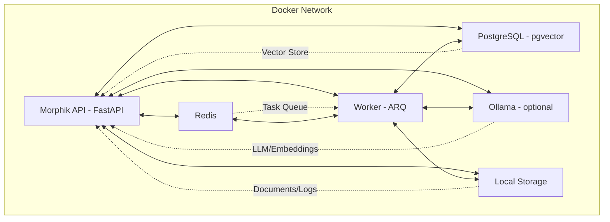
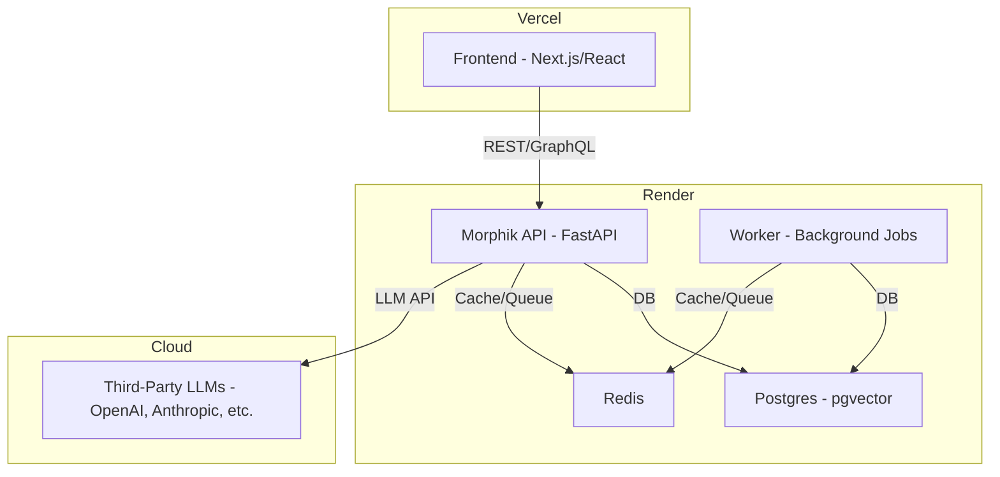

# Deployment Infrastructure & Platform Strategy

## Overview

This document describes the deployment infrastructure for Morphik Core, including recommended platforms for backend, frontend, and database, as well as authentication strategy and future-proofing considerations. It is designed to help you deploy and scale Morphik Core with minimal infrastructure overhead, while keeping options open for future growth.

---

## 1. High-Level Architecture

Morphik Core is a modular, containerized system. The main components are:

- **API Server**: FastAPI app, exposes REST endpoints (deployed on Render).
- **Worker**: Background task processor (ARQ).
- **PostgreSQL**: Database with pgvector extension for vector storage (managed by Render).
- **Redis**: Caching and task queue backend.
- **LLMs**: Cloud-hosted third-party LLMs (e.g., OpenAI, Anthropic) for completions/embeddings. Ollama (optional, for future local LLM inference).
- **Volumes**: Persistent storage for database, models, logs, and documents.

### Mermaid Diagram: High-Level Architecture

> **Note:** Cloud-hosted LLMs (e.g., OpenAI, Anthropic) are used for completions and embeddings. Ollama is included as an optional component for future local LLM inference. Documenting the use of third-party LLMs here is appropriate for architectural overviews. For detailed configuration and provider-specific settings, see the main configuration documentation (e.g., `morphik.toml` and related docs).

---

## 2. Recommended Deployment Platforms

### **Frontend**
- **Vercel**: Ideal for React/Next.js apps. Handles static hosting, SSR, and CDN distribution.

### **Backend/API & Database**
- **Render** (Recommended for MVP and beyond):
  - **API**: Deploy Morphik Core as a Docker service or from source.
  - **Database**: Managed Postgres (with pgvector support).
  - **Redis**: Managed Redis add-on.
  - **Autoscaling**: Supported on paid plans.
  - **User-friendliness**: Excellent dashboard, easy scaling, logs, and deployments.
  - **Pricing**: Starts at ~$7/month for web services and Postgres.
  - **Scalability**: Vertical and horizontal scaling, suitable for MVP to production.

---

## 3. Authentication Strategy

- **Built-in Auth**: Morphik Core uses JWT-based authentication, configurable via `morphik.toml` and `.env`.
- **Dev Mode**: For local/MVP use, dev mode allows static users and simple JWTs.
- **Production**: For real users, plan to integrate a third-party auth provider (e.g., Auth0, Clerk, Supabase Auth) that issues JWTs Morphik can verify.
- **No UI**: Morphik Core does not provide a user management UI—this is up to your frontend or external auth provider.

---

## 4. Deployment Topology (MVP Example)

---

## 5. Future-Proofing & Scalability

- **Autoscaling**: Render supports autoscaling (paid plans). You can scale API and worker services independently.
- **Managed DB**: Render offers managed Postgres with backups and scaling.
- **Portability**: The Docker-based setup means you can migrate to Kubernetes or raw cloud if needed, but this is not required for most projects.
- **Optional Local LLMs**: Ollama can be added in the future for local LLM inference if needed.

---

## 6. Recommendations

- **For MVP:**
  - Deploy backend (API, worker, Postgres, Redis) on Render for ease of use.
  - Deploy frontend on Vercel.
  - Use Morphik's built-in JWT auth for now; plan for a third-party provider for production.
  - Use cloud-hosted LLMs (OpenAI, Anthropic, etc.) for completions and embeddings. Document provider-specific settings in the main configuration documentation.
- **For Growth:**
  - Render can scale with your needs.
  - If you need more control, you can migrate to Kubernetes or cloud VMs later.
  - Add Ollama for local LLM inference if/when needed.

---

## 7. Additional Notes

- **No need for Kubernetes unless you have advanced infra needs.**
- **No need for a reverse proxy (Nginx/Traefik) if using Render—they handle this for you.**
- **Keep your infrastructure simple for as long as possible.**
