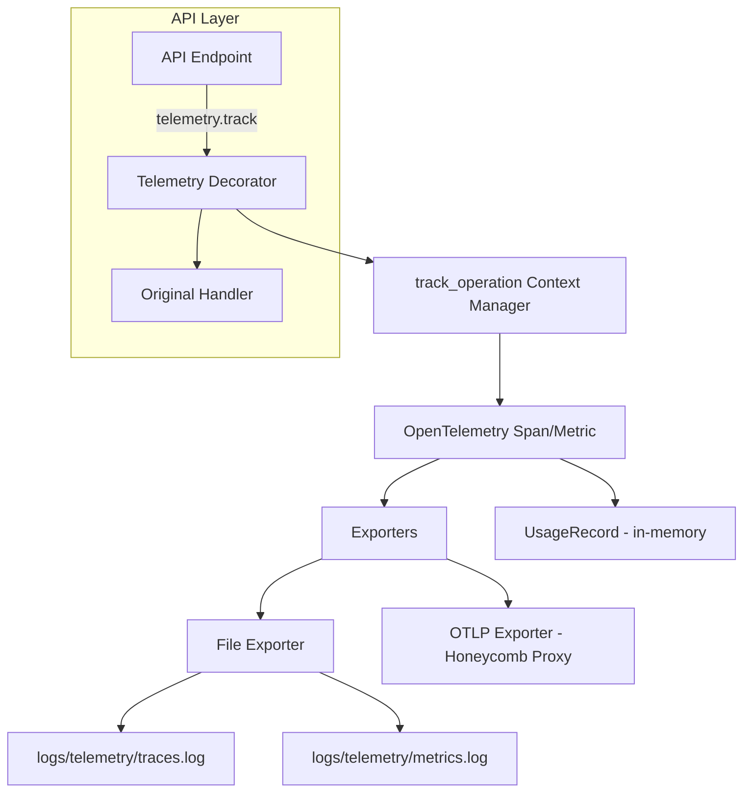
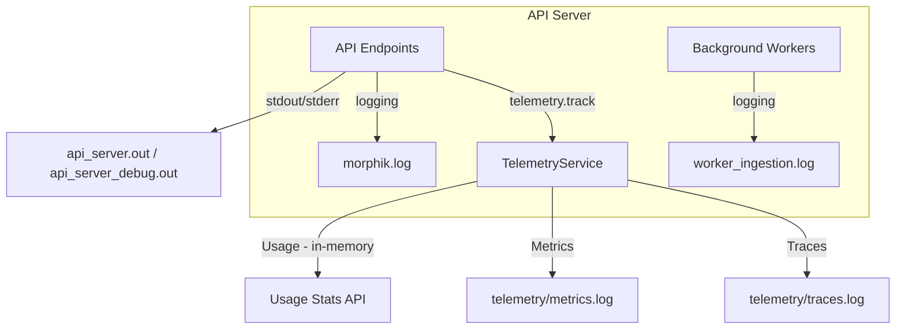
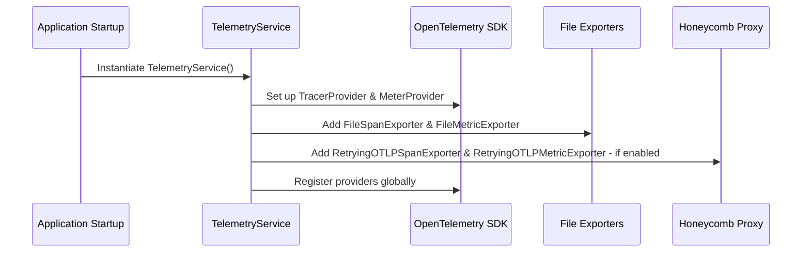
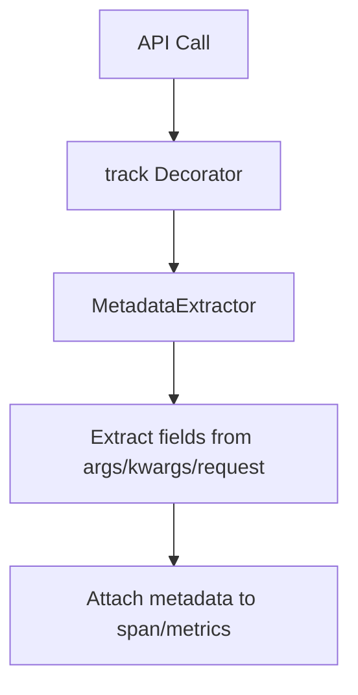

# Telemetry Architecture

## Overview

The telemetry system in the Morphik Core codebase provides comprehensive observability for API operations, usage, and performance. It is designed to be robust, privacy-conscious, and highly configurable, supporting both local and cloud-based monitoring (via Honeycomb).

---

## High-Level Telemetry Flow

**Description:**
- Each API endpoint is wrapped with a `@telemetry.track` decorator.
- The decorator uses a context manager to create a span and record metrics.
- Metadata is extracted and attached to the span.
- Data is exported both to local files and to Honeycomb via a proxy.
- Usage records are kept in memory for stats endpoints.
- **Traces** are saved to `logs/telemetry/traces.log` (JSON lines).
- **Metrics** are saved to `logs/telemetry/metrics.log` (JSON lines).

---

## Log Files and Data Storage

### 1. logs/morphik.log
- **Purpose:** Main application log for the API server and core services.
- **Data Stored:** General info, warnings, and errors from all core modules (API, database, vector store, embedding, etc.), startup/shutdown events, initialization, and operational messages.
- **Structure:** Text log, one entry per line. Format: `YYYY-MM-DD HH:MM:SS - module - LEVEL - message`

### 2. logs/worker_ingestion.log
- **Purpose:** Dedicated log for the ingestion worker process.
- **Data Stored:** Ingestion job lifecycle events (start, download, parse, errors), worker startup/shutdown, service initialization.
- **Structure:** Text log, one entry per line. Format: `YYYY-MM-DD HH:MM:SS,ms - module - LEVEL - message`

### 3. logs/telemetry/metrics.log
- **Purpose:** Stores all OpenTelemetry metrics exported by the application.
- **Data Stored:** JSON objects, one per line, representing metrics (counters, histograms, etc.). Includes operation counts, token counts, durations, and associated metadata.
- **Structure:** JSON lines (one metric per line). Example: `{ "name": "databridge.operations", ... }`

### 4. logs/telemetry/traces.log
- **Purpose:** Stores all OpenTelemetry traces (spans) exported by the application.
- **Data Stored:** JSON objects, one per line, representing spans for API calls and operations. Includes trace/span IDs, operation names, timings, attributes (metadata, user, status, etc.).
- **Structure:** JSON lines (one span per line). Example: `{ "name": "POST /query", "trace_id": "...", ... }`

### 5. api_server.out / api_server_debug.out
- **Purpose:** Not directly referenced in the codebase. If present, these are likely output logs from process managers (e.g., systemd, Docker, or shell redirection).
- **Data Stored:** Standard output and debug output from the API server process.
- **Structure:** Plain text, format depends on how the process is run.

---

## Application Layers and Log Destinations

**Legend:**
- **API Endpoints:** All HTTP endpoints in the main server.
- **Background Workers:** Ingestion and other async workers.
- **TelemetryService:** Handles OpenTelemetry traces/metrics and usage stats.
- **Log Files:**
  - `morphik.log`: General application log.
  - `worker_ingestion.log`: Ingestion worker log.
  - `telemetry/traces.log`: OpenTelemetry traces (JSON).
  - `telemetry/metrics.log`: OpenTelemetry metrics (JSON).
  - `api_server.out`, `api_server_debug.out`: Process output (if present).
- **Usage Stats API:** In-memory usage records, exposed via `/usage/stats` and `/usage/recent`.

---

## TelemetryService Initialization

**Description:**
- On startup, `TelemetryService` is instantiated as a singleton.
- It configures OpenTelemetry providers with both file and OTLP exporters.
- Exporters are robust, with retry logic for network issues.
- All configuration is loaded from the main config.

---

## Metadata Extraction

**Description:**
- Each operation type has a corresponding `MetadataExtractor`.
- Extractors are configured with fields to pull from the request, kwargs, or other sources.
- Metadata is attached to spans and metrics for rich observability.

---

## Detailed Description

### TelemetryService

- **Singleton**: Ensures only one instance is active.
- **Initialization**:
  - Loads config (enables/disables telemetry, sets endpoints, batching, etc.).
  - Sets up OpenTelemetry providers for tracing and metrics.
  - Adds both file and OTLP (Honeycomb) exporters.
  - Creates counters and histograms for operations, tokens, and durations.
- **Tracking**:
  - `@track` decorator wraps API handlers, extracting auth and metadata.
  - Uses an async context manager to create a span, record metrics, and handle errors.
  - User IDs are hashed for privacy.
  - Usage records are stored in memory for stats endpoints.
- **Exporters**:
  - **File Exporters**: Write traces and metrics to local files for debugging.
  - **Retrying OTLP Exporters**: Send data to Honeycomb via a proxy, with exponential backoff and error handling.
- **Metadata Extraction**:
  - Flexible system using `MetadataField` and `MetadataExtractor` classes.
  - Supports extracting from kwargs, request objects, and applying transforms.
  - Each operation type (ingest, query, update, etc.) has a tailored extractor.
- **API Integration**:
  - All major endpoints are decorated for telemetry.
  - FastAPI is instrumented for automatic HTTP tracing (excluding health checks and noisy spans).
- **Configuration**:
  - All settings are loaded from TOML/config, including enable flags, endpoints, timeouts, batching, etc.
  - Can be toggled or redirected without code changes.

### Privacy

- User IDs are always hashed before being sent to telemetry backends.
- No sensitive data is exported; only operation types, durations, and anonymized metadata.

### Testing

- There is a dedicated test (`test_telemetry_proxy.py`) that verifies spans and metrics are sent through the proxy and appear in Honeycomb.

---

## Example Usage

- To add telemetry to a new API endpoint, simply decorate it with `@telemetry.track(operation_type="my_operation", metadata_resolver=telemetry.my_metadata_extractor)`.
- To view local telemetry logs, check `logs/telemetry/traces.log` and `logs/telemetry/metrics.log`.
- To view usage stats, use the `/usage/stats` and `/usage/recent` endpoints.

---

## Conclusion

The telemetry system in Morphik Core is robust, privacy-conscious, and highly configurable. It provides deep observability into API usage and performance, with seamless integration into both local and cloud-based monitoring solutions.
