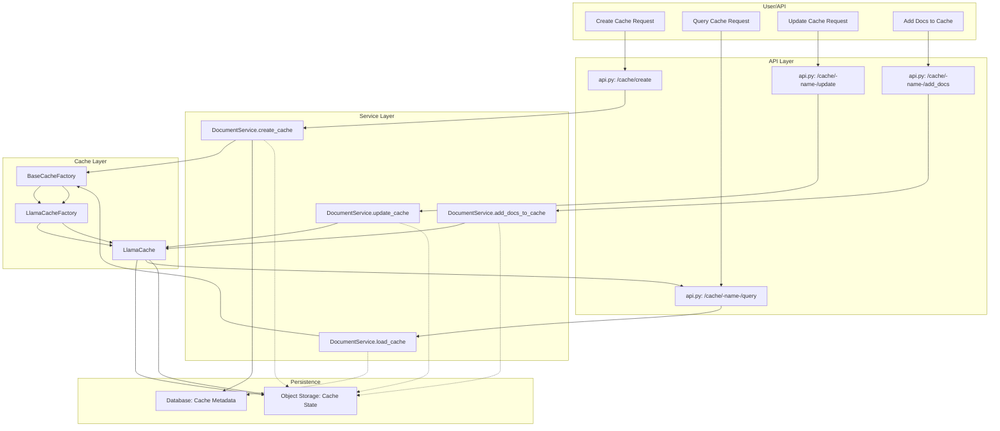

# Cache Management

## Overview

Morphik Core uses a cache management system to accelerate and augment LLM completions by storing and reusing model context (key-value caches) for specific document sets and queries. The system is designed for extensibility, but currently only supports the Llama backend.

---

## Architecture

### Mermaid Diagram: Cache Management Flow



---

## Cache Backends in Use

### What Backends Are Supported?

- **LlamaCache** (Llama.cpp): The only backend currently in use and supported in the codebase.
- **HuggingFaceCache**: Exists in the codebase, but is not registered or used anywhere in the main application.

### Is This Configurable?

- **No.** The backend is not currently configurable at runtime or via configuration files.
- The cache factory is hardcoded to `LlamaCacheFactory` in `core/api.py`:
  ```python
  from core.cache.llama_cache_factory import LlamaCacheFactory
  cache_factory = LlamaCacheFactory(Path(settings.STORAGE_PATH))
  ```
- All cache operations go through this factory, so only LlamaCache is ever instantiated.

### Where Is This Configured?

- The only relevant configuration is the storage path, set via `STORAGE_PATH` in your config (see `morphik.toml` and `core/config.py`).
- There is **no config option** to select a different cache backend.

---

## API Examples

### Create Cache

**Request:**
```http
POST /cache/create
Content-Type: application/json

{
  "name": "my_cache",
  "model": "QuantFactory/Dolphin3.0-Llama3.2-1B-GGUF",
  "gguf_file": "Dolphin3.0-Q4_K_S.gguf",
  "filters": {"type": "text"},
  "docs": ["doc_id_1", "doc_id_2"]
}
```

**Response:**
```json
{
  "success": true,
  "message": "Cache created successfully, state stored in bucket `caches` with key `my_cache_state.pkl`"
}
```

---

### Query Cache

**Request:**
```http
POST /cache/my_cache/query
Content-Type: application/json

{
  "query": "Summarize the content of the document.",
  "max_tokens": 100
}
```

**Response:**
```json
{
  "completion": "The document discusses...",
  "usage": {
    "prompt_tokens": 50,
    "completion_tokens": 20,
    "total_tokens": 70
  }
}
```

---

### Update Cache

**Request:**
```http
POST /cache/my_cache/update
```

**Response:**
```json
{
  "success": true
}
```

---

### Add Documents to Cache

**Request:**
```http
POST /cache/my_cache/add_docs
Content-Type: application/json

{
  "docs": ["doc_id_3"]
}
```

**Response:**
```json
{
  "success": true
}
```

---

## Cache Invalidation and Eviction

### Persistence Policy

- **Cache persistence is indefinite** by default.
- Cache state is serialized and stored in object storage (e.g., local disk or S3) and metadata is stored in the database.
- Caches remain available until explicitly removed or the storage is cleared.

### Invalidation/Eviction

- **No automatic eviction or TTL**: There is no built-in time-to-live or LRU eviction for caches.
- **Manual invalidation**: Caches can be removed from memory by restarting the service or calling `DocumentService.close()`, which clears all in-memory caches.
- **Storage cleanup**: To permanently delete a cache, you must manually remove its metadata from the database and its state file from storage. There is currently no API endpoint for cache deletion.

### In-Memory Cache

- The `DocumentService` keeps an in-memory dictionary of active caches (`active_caches`).
- This is cleared when the service is shut down or `close()` is called.
- If memory is a concern, you may want to periodically clear unused caches or implement a custom eviction policy.

---

## Extending Cache Backends

- To add a new backend, implement the `BaseCache` interface and register a new factory.
- Update the application initialization to use your new factory if needed.

---

## Summary Table

| Feature                | Supported? | Notes                                      |
|------------------------|------------|--------------------------------------------|
| LlamaCache             | Yes        | Default and only backend in use            |
| HuggingFaceCache       | No         | Exists in code, not used                   |
| Configurable backend   | No         | Hardcoded to LlamaCacheFactory             |
| Cache TTL/Eviction     | No         | Manual only, no automatic eviction         |
| API for cache deletion | No         | Manual deletion required                   |

---

## Questions?

- For cache deletion or advanced lifecycle management, consider opening a feature request or extending the API.

---
