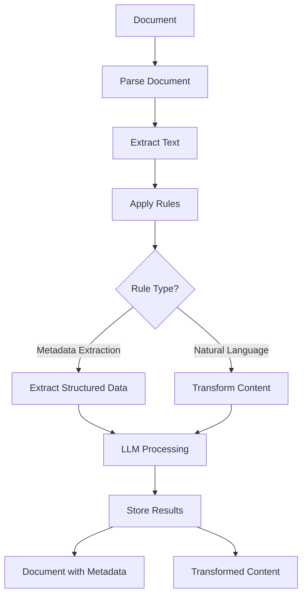
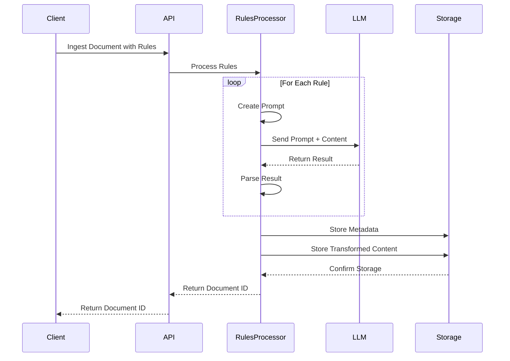

# Rules Processing in Morphik

Morphik enables robust, rules-based document ingestion using LLMs to extract metadata and transform content. Rules provide clear, repeatable instructions for reliable document processing—no need for complex custom pipelines.

---

## Core Concepts

Morphik's rules system supports two main operations during document ingestion:

1. **Metadata Extraction**: Pull structured information from documents into searchable metadata.
2. **Content Transformation**: Modify document content during ingestion (e.g., redaction, summarization).

Rules are processed in sequence, allowing you to chain operations (e.g., extract metadata, then redact sensitive info).

---

## Architecture Overview



The rules engine works by:
1. Accepting rules definitions during document ingestion
2. Converting each rule to the appropriate model class
3. Sequentially applying rules to document content
4. Using an LLM to perform extractions or transformations
5. Storing both the extracted metadata and modified content

---

## Rule Types

### MetadataExtractionRule
Extracts structured data from document content according to a schema. Ideal for converting unstructured documents into structured, queryable data.

```python
from morphik import Morphik
from morphik.rules import MetadataExtractionRule
from pydantic import BaseModel

# Define a schema for the metadata you want to extract
class ResumeInfo(BaseModel):
    name: str
    email: str
    phone: str
    skills: list[str]
    education: list[dict]
    experience: list[dict]

# Connect to Morphik
db = Morphik()

# Ingest a resume with metadata extraction
doc = db.ingest_file(
    "resume.pdf",
    metadata={"type": "resume"},
    rules=[
        MetadataExtractionRule(schema=ResumeInfo)
    ]
)

# The extracted metadata is now available
print(f"Candidate: {doc.metadata['name']}")
print(f"Skills: {', '.join(doc.metadata['skills'])}")
print(f"Education: {len(doc.metadata['education'])} entries")
```

### NaturalLanguageRule
Transforms document content according to natural language instructions. Useful for redaction, summarization, formatting changes, etc.

```python
from morphik import Morphik
from morphik.rules import NaturalLanguageRule

# Connect to Morphik
db = Morphik()

# Ingest a document with PII redaction
doc = db.ingest_file(
    "medical_record.pdf",
    rules=[
        NaturalLanguageRule(
            prompt="Remove all personally identifiable information (PII) including patient names, "
                  "addresses, phone numbers, and any other identifying details. Replace with [REDACTED]."
        )
    ]
)

# The document is stored with PII removed
```

---

## Technical Implementation

Morphik leverages LLMs to perform both metadata extraction and content transformation. The system is modular and configurable.

### LLM Integration

Morphik supports multiple LLM providers:
- **OpenAI**: For high-quality, cloud-based processing
- **Ollama**: For self-hosted, private LLM deployments

Configure the LLM for rules processing in your `morphik.toml` file using the registered models approach:

```toml
[registered_models]
openai_gpt4 = { model_name = "gpt-4" }
claude_sonnet = { model_name = "claude-3-sonnet-20240229" }
ollama_llama = { model_name = "ollama_chat/llama3.2", api_base = "http://localhost:11434" }

[rules]
model = "openai_gpt4"  # Reference to a key in registered_models
batch_size = 4096      # Size of content to process at once
```

---

## Rules Processing Logic

When a document with rules is ingested:

1. The document is parsed and text is extracted
2. The rules are validated and converted to model classes
3. For each rule:
    - The appropriate prompt is constructed based on rule type
    - The prompt and document content are sent to the LLM
    - The LLM's response is parsed (JSON for metadata, plain text for transformed content)
    - Results are stored according to rule type

For metadata extraction, the LLM is instructed to return structured JSON that matches your schema. For content transformation, the LLM modifies the text based on your natural language instructions.



---

## Performance Considerations

- Morphik automatically chunks large documents and processes rules in batches.
- The `batch_size` configuration in `morphik.toml` determines how content is split before passing to the LLM.
- Larger batch sizes may improve throughput but require more memory and may affect reliability for very large documents.

---

## Example Use Cases

### Resume Processing System

```python
from morphik import Morphik
from morphik.rules import MetadataExtractionRule, NaturalLanguageRule
from pydantic import BaseModel

# Define resume schema
class ResumeInfo(BaseModel):
    name: str
    email: str
    phone: str
    location: str
    skills: list[str]
    years_experience: int
    education: list[dict]
    work_history: list[dict]
    certifications: list[str] = []

# Create Morphik client
db = Morphik()

# Process resume with multiple rules
doc = db.ingest_file(
    "example_resume.pdf",
    metadata={"type": "resume", "source": "careers_page"},
    rules=[
        # First extract structured metadata
        MetadataExtractionRule(schema=ResumeInfo),
        # Then anonymize the content
        NaturalLanguageRule(
            prompt="Remove all personal contact information (name, email, phone, address) "
                  "but keep skills, experience, and qualifications."
        )
    ]
)

# Retrieve candidates in specific locations
candidates = db.retrieve_docs(
    "python machine learning",
    filters={"type": "resume", "location": "San Francisco"}
)

for candidate in candidates:
    print(f"Candidate: {candidate.metadata['name']}")
    print(f"Experience: {candidate.metadata['years_experience']} years")
    print(f"Skills: {', '.join(candidate.metadata['skills'])}")
    print(f"Education: {candidate.metadata['education'][0]['degree']} from {candidate.metadata['education'][0]['institution']}")
    print("---")
```

### Medical Document Processing with PII Redaction

```python
from morphik import Morphik
from morphik.rules import MetadataExtractionRule, NaturalLanguageRule
from pydantic import BaseModel

# Define medical record schema
class MedicalRecord(BaseModel):
    patient_id: str  # De-identified ID
    date_of_visit: str
    diagnosis: list[str]
    medications: list[str]
    procedures: list[str]
    lab_results: dict
    doctor_notes: str

# Create Morphik client
db = Morphik()

# Process medical document
doc = db.ingest_file(
    "patient_record.pdf",
    metadata={"type": "medical_record", "department": "cardiology"},
    rules=[
        # First extract structured metadata
        MetadataExtractionRule(schema=MedicalRecord),
        # Then redact PII from the content
        NaturalLanguageRule(
            prompt="Redact all patient personally identifiable information (PII) including: "
                  "1. Patient name (replace with 'PATIENT') "
                  "2. Exact dates of birth (keep only year) "
                  "3. Addresses (replace with '[ADDRESS]') "
                  "4. Phone numbers (replace with '[PHONE]') "
                  "5. SSN and other ID numbers (replace with '[ID]') "
                  "6. Names of patient family members "
                  "Preserve all clinical information, symptoms, diagnoses, and treatments."
        )
    ]
)

# The document is now stored with structured metadata and redacted content

records = db.retrieve_docs(
    "myocardial infarction treatment",
    filters={"type": "medical_record", "department": "cardiology"}
)

for record in records:
    print(f"Record ID: {record.metadata['patient_id']}")
    print(f"Diagnosis: {', '.join(record.metadata['diagnosis'])}")
    print(f"Medications: {', '.join(record.metadata['medications'])}")
    print(f"Procedures: {', '.join(record.metadata['procedures'])}")
    print("---")

# Or retrieve specific chunks of content
chunks = db.retrieve_chunks(
    "myocardial infarction symptoms",
    filters={"type": "medical_record", "department": "cardiology"}
)

for chunk in chunks:
    print(f"Content: {chunk.content[:100]}...")  # First 100 chars
    print(f"Document ID: {chunk.document_id}")
    print(f"Relevance Score: {chunk.score}")
    print("---")
```

---

## Optimizing Rule Performance

### Prompt Engineering
- **Be Specific**: Clearly define what you want extracted or transformed
- **Provide Examples**: For complex schemas, include examples in the prompt
- **Limit Scope**: Focus each rule on a specific task

### Rule Sequencing
- **Extract First, Transform Later**: Generally, extract metadata before transforming content
- **Chunking Awareness**: For very large documents, rules are applied to each chunk separately
- **Rule Complexity**: Split complex operations into multiple simpler rules

### LLM Selection
- **Metadata Extraction**: Use models with strong JSON capabilities (e.g., GPT-4)
- **Simple Redaction**: Smaller, faster models may suffice; local models are good for privacy
- **Complex Transformation**: May require more sophisticated models

---

## Conclusion

Morphik's rules-based ingestion provides a powerful, flexible system for extracting structured data from unstructured documents and transforming content during ingestion. This capability supports use cases from resume processing to medical record management to legal document analysis.

- **Client-Side Simplicity**: Define rules using schemas and natural language
- **Server-Side Power**: LLMs handle complex extraction and transformation
- **Configurable**: Adapt to different deployment scenarios and requirements

By separating rules definition from ingestion code, you can easily adapt your pipeline to different document types and requirements without changing your application code.

---

*Source: [Morphik Docs - Rules Processing](https://docs.morphik.ai/concepts/rules-processing)* 